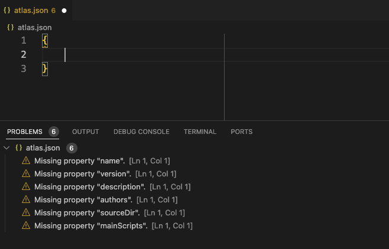

!!! note
    The **atlas.json** file is the VoltScript equivalent of Node.js's `package.json`, Maven's `pom.xml` or Rust's `cargo.toml`. It defines metadata about your project (name, version, authors, license), dependencies, structure, and scripts.

1. Right-click in the empty pane and select **New File** from the context menu.
1. Name the file `atlas.json`.
1. Type an opening curly brace **"{"** and press enter. VS Code automatically adds the closing curly brace **"}"**.
1. If the **PROBLEMS** view isn't visible, select **View** &rarr; **Problems**. Note the validation errors, which will identify any required properties which are missing.

    