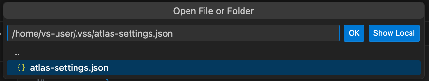

Within the `.vss` directory, an `atlas-settings.json` file holds a single JSON object containing other JSON objects, whose labels match the repositories listed in the `atlas.json` file. Each of these objects specify the type and necessary authentication credentials for the repository.

- For **github** types, this is a *Personal Access Token*.  
- For **webserver** types, there are two options:

    - Unauthenticated / Open Web Servers: the credentials should be an empty string.  
    - Authenticated / Controlled Access : the credentials should be a *Base64 encoded username and password*.  

- For **marketplace** types, this is a *username and password*.  

!!! info
    While this authentication information can be hard-coded directly into the `atlas-settings.json` file, VoltScipt Dependency Manager respects security concerns about having this hard-coded information accessible.  Therefore, if this information is stored in the format of *"${env.FOO}"*, the VoltScript Dependency Manager will retrieve the information from the appropriate environment variable (for this example "FOO").  

!!! warning
    There is no intention to support retrieving credentials from credential stores.

1. Create a text file called `atlas-settings.json` in your `.vss` directory:

    !!! note
        **WINDOWS ONLY**

        1. In Windows Explorer or a terminal, navigate to your user directory and open the `.vss` directory.  
        2. Select *File > New File...* from the VS Code Menu, and give it the name `atlas-settings.json`.  The new file should open in your VS Code editor.

        **Mac / Linux Dev Container ONLY**  

        1. From the VS Code Terminal (if necessary, open one by selecting *Terminal > New Terminal* from the VS Code Menu), type in the command:  
        ```shell
        touch ~/.vss/atlas-settings.json
        ```  
        2. Select *File > Open...* from the VS Code Menu, type:  
        ```shell
        ~/.vss/atlas-settings.json
        ```
        
        then click the OK button.

1. After the file opens in your VS Code editor, create an empty JSON object.

    !!! info
        Unlike the `atlas.json`, you will not immediately get content assistance.  The `atlas-settings.json` file defines a a JSON object which contains JSON objects for each repository, each with a label. So you will need to add a label whose value is a JSON object, and *that* JSON object will provide content assistance. Alternatively, there are snippets available by typing `atlas-settings` which will generate JSON objects with all possible options.

1. Add a label "hcl-github". For its value, create a JSON object. Required properties for it will appear in the **Problems** view.
1. Set type to "github".
1. Set token to your GitHub Personal Access Token.

    If you don't have one yet, follow GitHub's documentation for creating a [GitHub Personal Access Token](https://docs.github.com/en/authentication/keeping-your-account-and-data-secure/creating-a-personal-access-token). The value will begin "ghp_". For more details see [how-to guide](../../howto/archipelago/settings.md#github-personal-access-token).

1. Create another JSON object with the label of "volt-mx-marketplace".
1. Set type to "marketplace".
1. Set authUrl to "https://accounts.auth.demo-hclvoltmx.net/login".
1. Set username and password to your credentials for Volt MX Marketplace.

    You can create an account or check your login credentials at [Volt MX Marketplace](https://marketplace.demo-hclvoltmx.com/search/voltscript%20extension). If you are creating a new account, make sure to successfully log in to activate the account before using the credentials in dependency management.

    --8<-- "atlas-settings-sample.md"

1. Save your atlas-settings.json file.