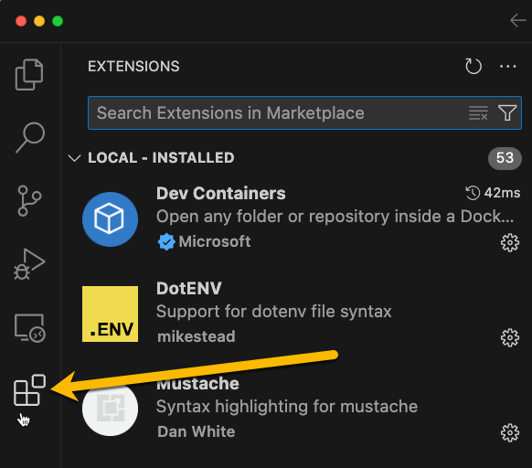

### Installing the Visual Studio Code extensions

1. Download the VoltScript VS Code extensions zip from [My HCLSoftware](https://my.hcltechsw.com/) and unzip.
1. Open Visual Studio Code.
1. Bring up the **Extensions** view by using Ctrl + Shift + X or clicking the **Extensions** icon in the **Activity Bar**.

    {:style="max-width:50%"}

1. In the title bar of the Extensions editor, click the ellipsis (...) and select "Install from VSIX...".

    !!! note
        The search bar allows you to search for an extension in the *VS Code Marketplace* and **not** in the folder of installed extensions. The "VoltScript Language Support" extension has not yet been published to the VS Code Marketplace.

1. Navigate to the directory into which you unzipped the VoltScript VS Code extensions.
1. Install **vscode-voltscript-1.1.0.vsix**.
1. Repeat steps 3 - 5 for **vscode-voltscript-archipelago-1.2.0.vsix**. **NOTE:** there is a new release for this extension, but not for the VoltScript Language Support extension.
1. Reload Visual Studio Code.

!!!warning "Error mapping path"
    Note that in EA4, if this is the first time you have installed the VoltScript Visual Studio Code Extensions, the VoltScript executable path is not correctly identified. It will find "HCL VoltScript Early Access 4 Notices and Information.txt" instead of the VoltScript executable. During EA4 you will need to manually amend the value.

    1. Go to Visual Studio Code's settings (Code > Settings > Settings on Mac, File > Preferences > Settings on Windows).
    1. Expand "Extensions" and select "VoltScript Language Support".
    1. Click on "Edit in settings.json"
    1. Amend the "voltscript.executablePath" value. It identifies the correct directory, but the filename needs amending to "VoltScript.exe" on Windows and "VoltScript" on Mac.
    1. Restart VS Code.

You are now ready to start coding with VoltScript in Visual Studio Code.