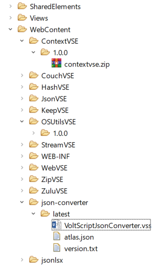

## Publishing

Include in your documentation a JSON object for the repository consumers will need to add into their atlas.json.

!!! note
    Always use an ID that will be unique for this URL, because consumers will need to add a corresponding entry with the same ID in their environment-wide atlas-settings.json.

### GitHub

If you are publishing to GitHub or GitHub Enterprise, the type should be "github". The URL format varies depending on the environment:

- For github.com, the URL will be "https://api.github.com/repos/" + OWNER_NAME.
- For GitHub Enterprise Server, the URL will be "http(s)://HOSTNAME/api/v3/repos/" + OWNER_NAME.

Example:

```json
{
  "id": "hcl-github",
  "type": "github",
  "url": "https://api.github.com/repos/HCL-TECH-SOFTWARE"
}
```

### Generic Web Server

For a generic web server or Domino database, the type should be "webserver". The URL will be appended with "/*LIBRARY*/*VERSION*/*MODULE*".

```json
{
  "id": "my-nsf",
  "type": "webserver",
  "url": "https://my-webserver.com/VoltScriptRepository.nsf"
}
```

!!! tip
    If you want to use Domino as a repository, you have two options:

    1. Create folders on the Domino server in <Domino>/data/domino folder.
    1. Use an NSF and either:
        - Open the Package Explorer view and add folders under the WebContent directory and drag your files in.
        - Add as File Resources. This is the less recommended approach, because the File Resource name needs to include forward slashes to simulate a folder structure.
    
    
