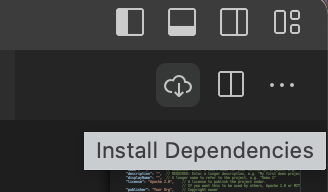

# Use VoltScript Build Manager

!!! info
    To get the JSON for existing VoltScript Extensions and Library Modules via dependency management, see the relevant repository or, for HCL-developed code, see the [extension references](../../references/vses.md) or [library module references](../../references/libraries.md).

This is delivered as a command line tool called "VoltScript_Archipelago" and a subdirectory called "archipelago". The functions available are:

- **VoltScript_Archipelago setup** checks for existence of `.vss` directory in the user's directory and creates it, if necessary.
- **VoltScript_Archipelago installDeps** prompts for parameters, builds project directories, and adds dependencies.
- **VoltScript_Archipelago listdeps** prompts for parameters and lists the dependencies that will get loaded.
- **VoltScript_Archipelago foundrypack** prompts for parameters and builds a zip to upload to Foundry.

## VS Code Extension

There is a separate VS Code Extension called *VoltScript Build Manager*. This provides Command Palette commands for "VoltScript: Run Dependency Setup", which calls `VoltScript_Archipelago setup`, and "VoltScript: Install Dependencies", which calls `VoltScript_Archipelago installDeps`.

The setup runs automatically, if there is an `atlas.json` file in the workspace. It also provides JSON validation for `atlas.json` and `atlas-settings.json` files, as well as code snippets for both.

{ style="width: 500px" }

If an `atlas.json` file is open, installing dependencies can also be done via the download icon added to the top of the editor.

{ style="width: 200px" }

## Required files

Dependency management requires two files:

- an **atlas-settings.json** file which is expected to be in the .vss directory of your user home directory.
- an **atlas.json** file which will be in your project.

For more details about setup, read the how to documentation for [atlas-settings.json](./settings.md) and [constructing and building atlas.json](./atlas.md).

Once you have your atlas-settings.json and atlas.json set up, you're ready to [run dependency management](running.md).