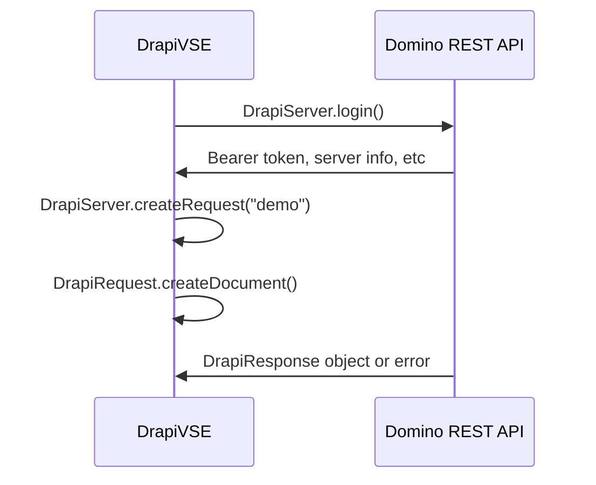
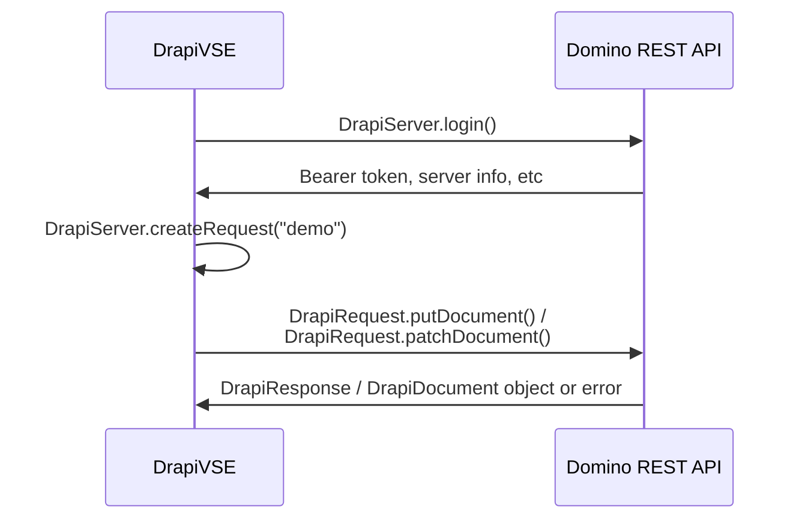
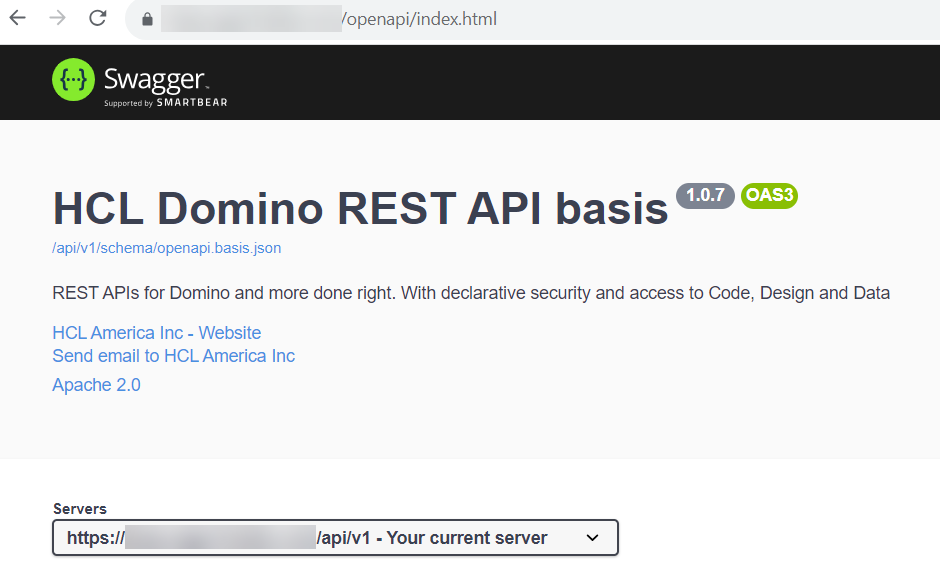

# Make Requests to Domino

--8<-- "setup.md"

## Introduction

When coding LotusScript, Domino access is expected and set up automatically via `NotesSession` object and specific user access automatically applied. VoltScript is middleware and may or may not require access to Domino data to perform its middleware functions. So the relevant VoltScript Extension, **DrapiVSE**, needs to be added, as for any other VoltScript extension. **DrapiVSE** allows you to easily work with the Domino Rest API, and the classes and methods it uses map to corresponding endpoints in the Domino Rest API.

## VoltScript dependencies

Incorporating DrapiVSE is straightforward. You just need to add the following JSON object to the `vsesDependencies` element in your `atlas.json`.

```json
        "DrapiVSE": {
            "library": "DrapiVSE VoltScript Extension",
            "version": "1.0.0",
            "module": "drapivse",
            "repository":"volt-mx-marketplace"
        }
```

--8<-- "vse-repository.md"

To use the extension in your script, enter `UseVSE "*DrapiVSE"`.

You will probably also want to incorporate [JsonVSE](./json.md#voltscript-dependencies).

## Domino REST API

DrapiVSE is designed to access Domino REST API. The VoltScript Extension is only designed for data access, not database or user management. So only the data APIs are exposed in DrapiVSE. Of course, this doesn't preclude you making [REST calls via WebVSE](web.md) to other Domino REST API endpoints.

!!! info
    This how-to guide assumes familiarity with Domino REST API terminology. For more information on the Domino REST API terminology, see the [Domino REST API documentation](https://opensource.hcltechsw.com/Domino-rest-api/topicguides/understanding.html){: target="_new" rel="noopener noreferrer”}

It's important to bear in mind performance because the VoltScript code will be running as middleware, making individual REST service calls for most APIs. The following diagrams demonstrate REST service calls for creating a document and updating an existing document:

### DrapiVSE and Domino REST API: Create Document



### DrapiVSE and Domino REST API: Update Document



!!! tip
    A good understanding of Domino REST API is important to use DrapiVSE at its best. Coding using DrapiVSE in the same you would code using Notes classes will be difficult, as DrapiVSE closely corresponds with the DRAPI endpoints, and you will not get an optimal outcome. Think of it as working with a Rest API, not with the Domino API.

### DrapiServer class

The `DrapiServer` class is the entrypoint for any Domino REST API calls. You need to specify the `serverURL`, which is protocol + server name + "api/v1". This is the same URL that appears under "Servers" on the Swagger REST API:



After adding the `serverURL` you will need to call `login()` passing a username and password. The following code will login to the server, assuming the variables `serverName`, `userName` and `password` have been set.

``` voltscript
Function login(server as DrapiServer, userName as String, password as String)
    server.serverURL = SERVER_NAME
    Call server.login(userName, password)
End Function
```

This will give a logged in session to the Domino REST API as the passed user, which can be verified with `server.connected` or by retrieving the token with `server.JWTToken`.

#### Passing an Existing Token

Best practice is to log in once and re-use a valid JWT token for subsequent requests, serialized by whatever is calling the VoltScript code. DrapiServer supports the ability to pass an existing token, `server.JWTToken` is read-write, not read-only, so can be set. When doing so, you do not need to run `Call server.login()` again, the valid token will just be passed with the relevant DrapiRequest. However, `server.connected` will be false - this is only set when calling `.login()`.

!!! warning
    You will need to ensure you handle a token that has expired. This may require recreating the DrapiRequest after updating the DrapiServer instance.

!!! tip
    If you are not storing the token for future use, you can logout at the end of the code. This will invalidate the JWT token and prevent it being re-used. This can be done with Try/Catch/Finally:

    ``` voltscript
        Try
            'Login and run your code
        Catch
            Print "Error " & Error() & " on line " & Erl()
        Finally
            If (Not server is Nothing && server.connected) Then server.logout
        End Try
    ```

### DrapiRequest class

The `DrapiRequest` class is the entrypoint for data operations on a specific Domino REST API scope, including accessing list (view) and document data, and performing DQL queries. All requests except `getServerInfo()` require you to pass the relevant scope when creating the request.

Once you have a `DrapiRequest` object then any method called against it will return a `DrapiResponse` object. You use `DrapiRequest` to work with objects such as lists (i.e. Domino views and folders), documents, profiles, and so on.

You can use `DrapiResponse.ResponseCode` to determine if the request was processed correctly (it will have a ResponseCode of 200). Then you can use `DrapiResponse.ContentBody` to access the JSON response content of your request.

!!! note
    You will probably want to use JsonVSE to more easily parse the JSON content from Domino REST API.

!!! tip
    When creating a DrapiRequest, calls can be chained, for example `Set serverInfo = server.createRequest("").getServerInfo()`.

#### Accessing list / view data

One of the primary entrypoints to document data is Domino views, or in the Domino REST API terminology "lists". DrapiVSE retains Domino REST API's terminology. Typically the developer will know the name of the list to use, but if not then the developer can use `DrapiRequest.getLists()` to get a list of available/configured lists, or a subset thereof.

There are two functions available for accessing view data:

- **`getListEntries()`** for accessing view entries or documents based on view entries. This is also used to get a subset of entries/documents based on one or more key(s), like getViewEntriesByKey().
- **`getListPivot()`** for retrieving view data as a pivot table. Computes min, max, count, total of retrieved view entries.

Since the `getListEntries()` method is capable of retrieving subsets of documents based on a variety of parameters, a special *arguments object* is needed to contain all of the parameters passed to `getListEntries()`. This object is based on the **GetListEntriesArgs** class.

The following code will get the first 5 entries from a view. It is assumed that the DrapiServer is already logged in:

``` voltscript
Function getEntries(server as DrapiServer, scopeName as String, viewName as String) as JsonObject
    Dim request as DrapiRequest, response as DrapiResponse
    Dim entryArgs as New GetListEntriesArgs
    Dim parser as New JsonParser, jobj as JsonObject

    Set request = server.createRequest(scopeName)
    
    entryArgs.mode = "default"
    entryArgs.RichTextAs = "html"
    entryArgs.Count = 5

    Set response = request.getListEntries(viewName, entryArgs)

    If response.ResponseCode = 200 Then
        Call parser.loadFromJSON(response.ContentBody)
        Set jobj = parser.getRootObject
    End If

    return jobj
End Function
```

!!! tip
    CRUD in web and mobile applications work best when providing targeted access to a small set of data. For this reason, [DQL](#retrieval-via-dql) is a good approach when building your user experience.

### Basic CRUD Operations

#### Creation

Creating a document requires knowing that a form is exposed and the the items expected for the "default" mode, which is the mode used when creating a document. The developer should know this, it is available by checking the schema for the specific application. The following code will create a document and save it to Domino REST API:

!!! Note
    `DrapiDocument` is an extension of `DrapiResponse`, which means properties such as *ResponseCode*, *ContentBody*, and so on are available as well as the `DrapiDocument` properties and methods.

``` voltscript
Function createCustomer(server as DrapiServer, scopeName as String) as DrapiDocument
    Dim request as DrapiRequest, cdoc as DrapiDocument
    Dim jobj as New JsonObject

    Set request = server.createRequest(scopeName)
    Call jobj.insertValue("Form", "Customer")
    Call jobj.insertValue("Color", "Red")
    Call jobj.insertValue("first_name", "John")
    Call jobj.insertValue("last_name", "Doe")
    Call jobj.insertValue("gender", "Male")
    Call jobj.insertValue("Pet", "Cockapoo")
    Set cdoc = request.createDocument(jobj.toString(False))

    If cdoc.ResponseCode = 200 Then
        Print "Customer created with ID: " & cdoc.UNID
    Else
        Print "Error creating customer: code: " & cdoc.ResponseCode & ", message: " & cdoc.ErrorMessage
    End If

    return cdoc
End Function
```

!!! note
    `DrapiRequest.createDocument()` can take two additional arguments, a rich text format (default is html) and a parent UNID. When creating a new document, if you provide a parent UNID, the document will be created as a response to the given parent document.

You can also create multiple documents at once, in bulk, using `DrapiRequest.bulkCreateDocuments()`. The example below assumes that *docsjson* is a String containing an array of json objects representing the documents to be created.

``` voltscript
Sub createCustomers(server as DrapiServer, scopeName as String, docsjson as String)
    Dim request as DrapiRequest, response as DrapiResponse
 
    Set request = server.createRequest(scopeName)
    Set response = request.bulkCreateDocuments(docsjson)
    If response.ResponseCode = 200 Then
        Print "Customers created successfully."
    Else
        Print "Error creating customers: code: " & response.ResponseCode & ", message: " & response.ErrorMessage
    End If
End Sub
```

#### Form Access Modes

Domino REST API uses different Form Access Modes for managing what fields are available for read / update at particular stages in the workflow. Consequently, it's important to know the Form Access Modes available and you will need to specify the required Form Access Mode when updating the document. `DrapiRequest.GetDocumentModes()` will provide the Form Access Modes and fields that can be edited when passing an UNID:

``` voltscript
Function getDocModes(server as DrapiServer, scopeName as String, unid as String) as JsonObject
    Dim request as DrapiRequest, response as DrapiResponse
    Dim parser as New JsonParser, jobj as JsonObject
    Set request = server.createRequest(scopeName)
    Set response = request.getDocumentModes(unid)
    If response.ResponseCode = 200 Then
        Call parser.loadFromJSON(response.ContentBody)
        Set jobj = parser.getRootObject
    End If
    return jobj
End Function
```

#### Retrieval

Retrieving a document is done using `DrapiRequest.getDocument()`, which returns a `DrapiDocument` object. The third parameter is the form access mode.

``` voltscript
Function getDoc(server as DrapiServer, scopeName as String, docID as String) as DrapiDocument
    Dim request as DrapiRequest, doc as DrapiDocument
    Set request = server.createRequest(scopeName)
    Set doc = request.getDocument(docID, "html", "default")
    Return doc
End Function
```

!!! warning
    Exposing rich text content to editing outside Notes Client can be risky. Different rich-text editors have different abilities to accept / output richly-formatted content. So even with no changes, there are no guarantees the user interface will faithfully round-trip the content outputted. Outputting as HTML means the code retains whatever styling used when creating the content. This may mean the outputted style does not fit naturally with the rest of the web application.

#### Update

To update the document, you can use a variety of methods, including:

- You could get the document in a `DrapiDocument` object, replace the JSON in `DrapiDocument.JSONValue` and then call `DrapiDocument.put()`, with the relevant Form Access Mode.
- You could use `DrapiRequest.putDocument()` to replace all of the document JSON content.
- You could use `DrapiRequest.patchDocument()` to just replace one or more field values in the given document.

The example below uses `DrapiRequest.patchDocument()` to update the *Color* to *Red*, and then returns the document's contents as a `DrapiDocument`.

``` voltscript
Function updateDoc(server as DrapiServer, scopeName as String, unid as String) as DrapiDocument
    Dim request as DrapiRequest, doc as DrapiDocument
    Dim jobj as New JsonObject
    Set request = server.createRequest(scopeName)
    Call jobj.insertValue("Color", "Red")
    Set doc = request.patchDocument(unid, jobj.toString(False), "html", "default")
    Return doc
End Function
```

#### Delete

Deleting a document can be done by passing either the unid to `DrapiRequest.deleteDocument` or by getting a `DrapiDocument` object and calling `DrapiDocument.Delete()`. Both require passing a Form Access Mode name in which the current user has permissions to delete documents.

!!! warning
    If the deletion isn't successful, a 400 error will be returned in the *ResponseCode*, with further details in the *ErrorMessage*.

The following code will delete a document using just its UNID:

``` voltscript
Sub deleteDocumentByUNID(server as DrapiServer, scopeName as String, unid as String)
    Dim request as DrapiRequest, response as DrapiResponse
    Set request = server.createRequest(scopeName)
    Set response = request.deleteDocument(unid, "default")
    If response.ResponseCode = 200 Then
        Print "Document with UNID " & unid & " deleted successfully."
    Else
        Print "Error deleting document: code: " & response.ResponseCode & ", message: " & response.ErrorMessage
    End If
End Sub
```

There may be occasions where you want to act upon a document first, either checking item values or copying it somewhere, for example to an archive. The following code will retrieve a document, create a copy, delete the original, and return the new document:

``` voltscript
Function copyAndDeleteDocument(server as DrapiServer, scopeName as String, unid as String) as DrapiDocument
    Dim request as DrapiRequest, response as DrapiResponse
    Dim doc as DrapiDocument, newdoc as DrapiDocument
    Set request = server.createRequest(scopeName)
    Set doc = request.getDocument(unid, "default")
    If doc.ResponseCode = 200 Then
        Set newdoc = request.createDocument(doc.JsonValue)
        If newdoc.ResponseCode = 200 Then
            Set response = request.deleteDocument(unid, "default")
        End If
    End If
    return newdoc
End Function
```

### Bulk CRUD operations and DQL

Bulk operations are done from `DrapiRequest`, which returns a `DrapiResponse` object. You can then access the `DrapiResponse.ResponseCode` to check on the success of your call (returns a 200 if successful), `.ContentBody` to access the actual JSON content returned, or `.ErrorMessage` if there was a problem.

Overall, bulk operations are more efficient because it will make a single REST service call to Domino REST API instead of one REST service call for each document.

There are five Bulk operations available in `DrapiRequest`:

- **BulkGetDocuments** - retrieves one or more documents based on the UNIDs provided in a String Array
- **BulkCreateDocuments** - creates one or more documents from the JSON array provided as a String
- **BulkFolderDocuments** - adds or removes one or more documents based on the UNIDs provided in a String Array
- **BulkPatchDocuments** - updates one or more field values provided in a serialized JSON array, based on the documents identified by the provided DQLQuery
- **BulkDeleteDocuments** - deletes one or more documents based on the UNIDs provided in a String Array

#### Retrieval by UNIDs

If you have a list of UNIDs for documents, you can use `DrapiRequest.bulkGetDocuments()` to retrieve them. The following code will take an array of UNID strings and return an array of JSON objects, where each string corresponds to the document JSON.

``` voltscript
Function getDocuments(server as DrapiServer, scopeName as String, unids() as String) as JsonObject
    Dim request as DrapiRequest, response as DrapiResponse
    Dim parser as New JsonParser, jobj as JsonObject
    Set request = server.createRequest(scopeName)
    Set response = request.bulkGetDocuments(unids, "html", "default", True)
    If response.ResponseCode = 200 Then
        Call parser.loadFromJSON(response.ContentBody)
        Set jobj = parser.getRootObject
    End If
    return jobj
End Function
```

#### Retrieval via DQL

DQL provides the ability to return documents based on a query. The following code would return the first five Customer documents where the color is "Blue":

``` voltscript
Function performDqlQuery(server as DrapiServer, scopeName as String) as JsonObject
    Dim request as DrapiRequest, response as DrapiResponse
    Dim parser as New JsonParser(), jsonObj as JsonObject
    Dim query as New JsonObject
    Dim vars as New JsonObject

    Set request = server.CreateRequest(scopeName)

    Call query.insertValue("maxScanDocs", 5000)
    Call query.insertValue("maxScanEntries", 2000)
    Call query.insertValue("mode", "default")
    Call query.insertValue("noViews", False)
    Call query.insertValue("timeoutSecs", 300)
    Call query.insertValue("query", "form = 'Customer' and Color = ?Color")
    Call query.insertValue("viewRefresh", False)
    Set vars = new JsonObject()
    vars.label = "variables"
    Call vars.insertValue("Color", "Blue")
    Call query.insertObject(vars)

    Set response = request.dqlQuery(query.toString(True), "execute", 5)
    If response.ResponseCode = 200 Then
        Call parser.loadFromJSON(response.ContentBody)
        Set jsonObj = parser.getRootObject()
    Else
        Print "Error performing DQL query: " & response.ResponseCode & " - " & response.ErrorMessage
    End If
    Return jsonObj
End Function
```

!!! tip
    Use JsonVSE to build the query rather than trying to build it as a String. If you get an error message for invalid JSON, print out the JSON and cross-reference it with / try it in Swagger on the relevant server.

!!! note
    `DrapiRequest.DQLQuery()` can also be used to perform other DQL verbs - "query" and "explain".

#### Update via DQL

Bulk update is performed via a DQL query, a list of items to update and a Form Access Mode with which to perform the update. The `DrapiRequest.bulkPatchDocuments()` method can either return the full JSON of the documents at the relevant mode, or a JSON object that contains a summary of the documents updated. The following code will update Customers where Color is "Red", changing the color to "Maroon". It will return all values from the underlying documents.

``` voltscript
Function updateDocuments(server as DrapiServer, scopeName as String) as String
    Dim request as DrapiRequest, response as DrapiResponse
    dim query as String
    Dim replaceItems as New JsonObject()

    Set request = server.CreateRequest(scopeName)
    
    Call replaceItems.insertValue("Color", "Maroon")
    query = "form = 'Customer' and Color = 'Red'"

    Set response = request.bulkPatchDocuments(query, replaceItems.toString(False), "html", "default", 5000, True, True)

    If response.ResponseCode = 200 Then
        Return response.ContentBody
    Else
        Print "Error updating documents: " & response.ResponseCode & " - " & response.ErrorMessage
        Return ""
    End If
End Function
```

If `False` had been passed as the last parameter of `DrapiRequest.bulkPatchDocuments()` the result would have looked something like this:

```json
[
{"statusText":"OK","status":200,"message":"Document 2B057308D23ED5AD00258A210046664B updated","unid":"2B057308D23ED5AD00258A210046664B"},
{"statusText":"OK","status":200,"message":"Document A1057308D23ED5AD00258A210046527F updated","unid":"A1057308D23ED5AD00258A210046527F"}
]
```

#### Deletion by UNIDs

Just like `DrapiRequest.bulkGetDocuments()`, you can use an array of UNIDs to delete multiple documents at once.

The following example will delete the documents indicated in the UNID string array, and return a status message for each document:

``` voltscript
Function deleteDocuments(server as DrapiServer, scopeName as String, unids() as String) as JsonObject
    Dim request as DrapiRequest, response as DrapiResponse
    Dim parser as New JsonParser, jobj as JsonObject
    Set request = server.createRequest(scopeName)
    Set response = request.bulkDeleteDocuments(unids, "default")
    If response.ResponseCode = 200 Then
        Call parser.loadFromJSON(response.ContentBody)
        Set jobj = parser.getRootObject
    End If
    return jobj
End Function
```

### Attachments

#### Add an attachment

Adding an attachment is done by using `DrapiRequest.createAttachment()`. You need to pass the filepath of the attachment to add and an optional name of a field in which to place the attachment.

The following code will create an attachment in a field called "RichText" in the provided `DrapiDocument`:

!!! Note
    You could bypass `DrapiDocument` altogether if you already know the UNID of the target document by simply calling `DrapiRequest.createAttachment()` directly.

``` voltscript
Function addAttachment(doc as DrapiDocument, filePath as String) as String
    Dim request as DrapiRequest, response as DrapiResponse
    Set request = doc.ParentRequest
    If filepath = "" Then
        filePath = CurDir() & "/libs/functions.vss"
    End If
    Set response = request.createAttachment(doc.Unid, filePath, "RichText")
    If response.ResponseCode = 200 Then
        Return response.ContentBody
    Else
        Print "Error creating attachment: " & response.ResponseCode & " - " & response.ErrorMessage
        Return ""
    End If
End Function
```

#### Download an attachment

Downloading an attachment requires knowledge of the attachment name to download. The following code will download the indicated attachment in the provided document to the indicated targetpath, assuming the Form Access Mode is configured correctly:

``` voltscript
Sub getAttachment(doc as DrapiDocument, attachName as String, targetPath as String)
    Dim request as DrapiRequest, response as DrapiResponse
    Dim parser as New JsonParser, jobj as JsonObject
    Set request = doc.ParentRequest
    Set response = request.getAttachment(doc.UNID, attachName, targetPath)
    If response.ResponseCode = 200 Then
        Print "Attachment downloaded successfully to " & targetPath
    Else
        Print "Error downloading attachment: " & response.ResponseCode & ", see target file for error"
    End If
    return jobj
End Sub
```

#### Delete an Attachment

Similar to downloading an attachment, deleting an attachment requires knowledge of the attachment name to be deleted. The FieldName parameter indicates the name of the field in which the attachment resides. You should pass this to remove the hotspot for the attachment from that rich text field, otherwise the hotspot will remain. If the attachment is attached directly to the document, not a field, there is not need to provide this parameter.

``` voltscript
Function deleteAttachment(doc as DrapiDocument, attachName as String, fieldName as String) as JsonObject
    Dim request as DrapiRequest, response as DrapiResponse
    Dim parser as New JsonParser, jobj as JsonObject
    Set request = doc.ParentRequest
    Set response = request.deleteAttachment(doc.UNID, attachName, fieldName)
    If response.ResponseCode = 200 Then
        Call parser.loadFromJSON(response.ContentBody)
        Set jobj = parser.getRootObject
    End If
    return jobj
End Function
```

### Investigate APIs for more

Other APIs are available for more various other Domino REST API functions, like folder manipulation, profile document handling, agent processing, and use of QRP views. See the [API documentation](../../apidocs/drapivse/index.html) for more details.

The complete implementations of the code snippets are available on [GitHub](https://github.com/HCL-TECH-SOFTWARE/voltscript-samples/tree/main/samples/drapivse){: target="_blank" rel="noopener noreferrer"}.