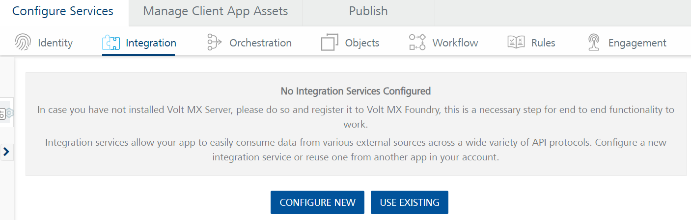
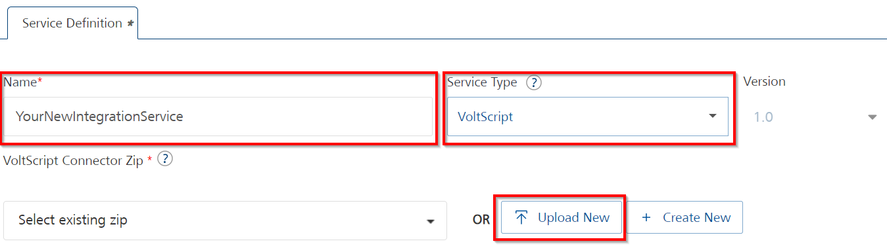
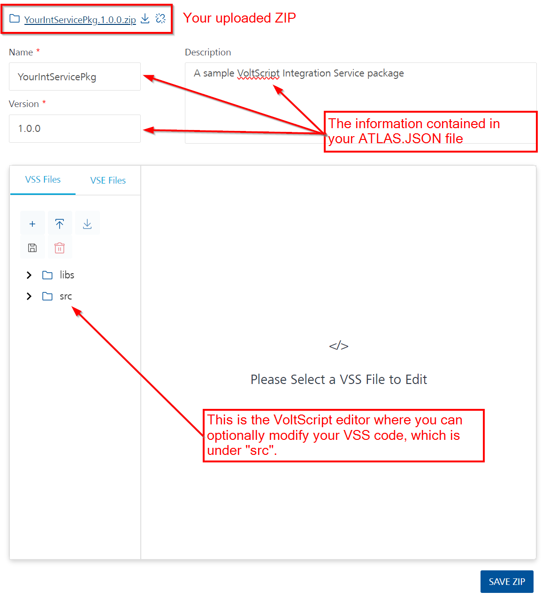
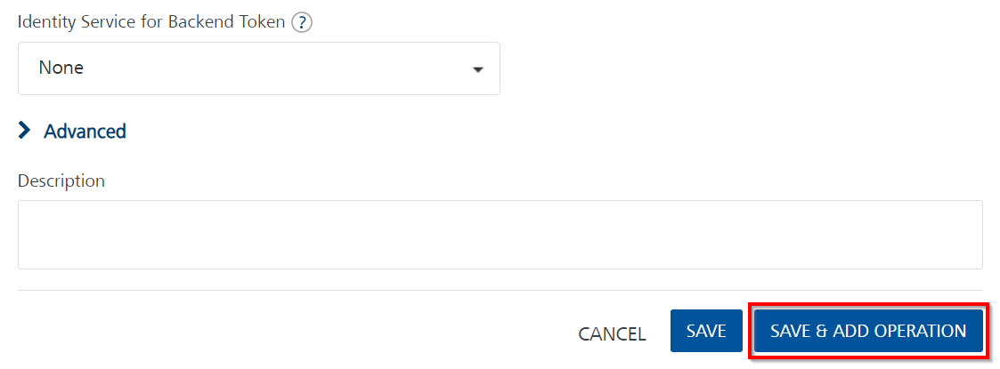
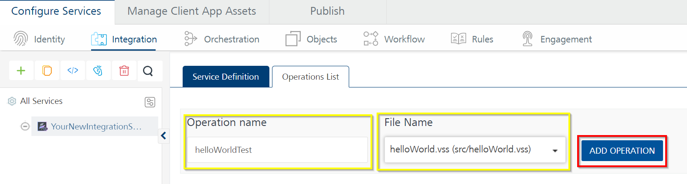
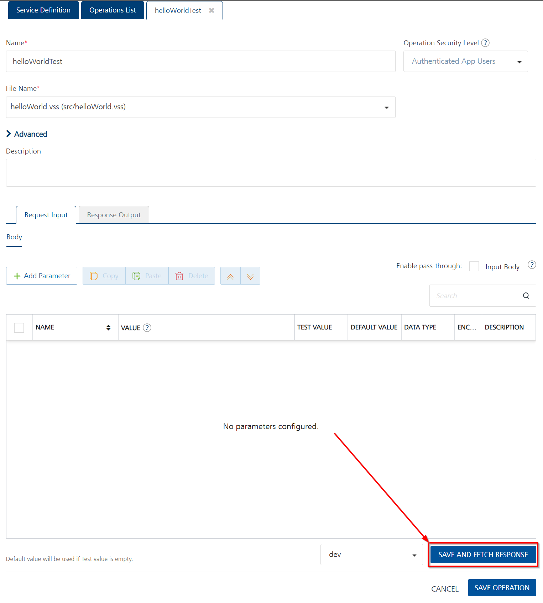
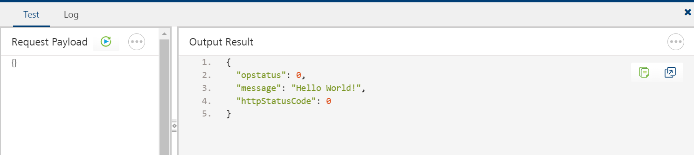

# Configure a VoltScript Integration Service

Once you have written and packaged your Integration Service code, you need to configure your Integration Service on Volt Foundry and upload your packaged code.

!!! Note
    This assumes you have already written your Integration Service code, packaged it up for upload to Volt Foundry, and have a Volt Foundry server available. If you are unfamiliar with this process it is recommended you go through the [Introduction to VoltScript for Volt Foundry](../../../tutorials/foundry/index.md){: target="_blank" rel="noopener noreferrer"} tutorials.

## Creating an Integration Service

1. Log into your Volt Foundry server.
1. On the **Apps** page, open an existing app or click **ADD NEW**.

    

1. On **Configure Services** tab, click the **Integration** tab and then click **CONFIGURE NEW**.

    

1. Set the **Name** to the desired name for your Integration Service.
1. Select "VoltScript" under **Service Type**.
1. Click **Upload New** to upload your packaged Integration Service ZIP file. 

    

    Once your ZIP file is uploaded you will see it listed, along with the *Name*, *Description*, and *Version* you entered in your package's `atlas.json` file, as well as an *Editor* pane where you could optionally modify your VSS code.

    {: target="_blank" rel="noopener noreferrer"}

1. If you have configured an Identity Service for your Application, select it under **Identity Service for Backend Token**.
1. You may optionally enter a **Description**.
1. Once you're done, click **SAVE & ADD OPERATION**.

   

## Adding an Operation to an Integration Service

Once you click **SAVE & ADD OPERATION** you're taken to the *Operations List* tab, where you can configure a new Operation.

1. Enter a name for your Operation in the **Operation Name** field.
1. Select the VSS containing the desired Operation in the **File Name** dropdown.
1. Click **ADD OPERATION**.
    
    

1. After adding your new Operation you can click **SAVE AND FETCH RESPONSE** to save your operation and test to make sure it works.

    {: target="_blank" rel="noopener noreferrer"}

    If everything is successful, you should get an *Output Result* console window pop up at the bottom of the screen with the results of your operation.
    
    

### Advanced options

| Field | Description |
| --- | --- |
| Custom Code Invocation - Preprocessor and Postprocessor | You can add pre and post processing logic to services to modify the request inputs. Only Rules are available for VoltScript integration service preprocessors and postprocessors. |
| Properties | Additional Configuration Properties allows you to configure service call time out cache response. |
| Front End API | Front-end API allows you map your endpoint (or) backend URL of an operation to a front-end URL. |
| Server Events | Using Server Events you can configure this service to trigger or process server side events. |

For more details, see [Advanced Configuration](./advanced.md).

### Configure request operation

Integration services accept only `form-url-encoded` inputs for all the input parameters provided in the service input parameters (request input).

To forward the body of the client's request to backend as it is, select the **Enable pass-through input body** checkbox.

You can perform the following actions in Request Input tab:

1. Click **Add Parameter** to add an entry if the entries for input and the output tabs doesn't exist.
1. To make duplicate entries, select the checkbox for the entry, click **Copy** and **Paste**.
1. To delete an entry, select the checkbox for an entry and click **Delete** .
1. To configure the request input tab, provide the following details:  

    | Field | Description |
    | --- | --- |
    | Name | It contains a Unique Identifier. Change the name if required. |
    | Test Value | Enter a value. A test value is used for testing the service. |
    | Default Value | Enter the value, if required. The default value will be used if the test value is empty. |
    | Scope | Select Request or Session. It's set to **Request** by default. **Request** indicates that the value must be retrieved from the HTTP request received from the mobile device. **Session** indicates that the value must be retrieved from the HTTP session stored on Volt Foundry. **Identity**: If this is selected, you can map a request parameter to a value of the response from the identity provider. |
    | Data Type | **Select one of the following data types**  **String** - A combination of alpha-numeric and special characters. Supports all formats including UTF-8 and UTF-16 with no maximum size limit.   **Boolean** - A value that can be true or false.  **Number** - An integer or a floating number.  **Collection** - A group of data, also referred as data set. |
    | Encode | Select the checkbox to enable encoding of an input parameter. For example, the name New York Times would be encoded as _New_York_Times_ when the encoding is set to True. The encoding must also adhere to the HTML URL encoding standards. |
    | Description | Provide a suitable description. |

1. To validate the operation details, click **Save and Test**.

### Configure response operation

In a VoltScript service, the complete response from the VoltScript code is sent to the client device.

!!! note
    By default, the `opStatus` and `httpStatusCode` values for VoltScript services are added as 0 and 200.