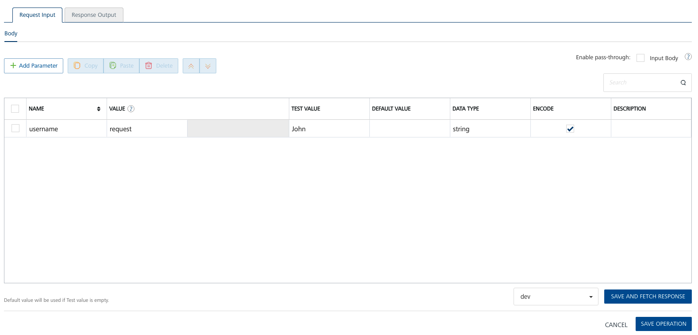
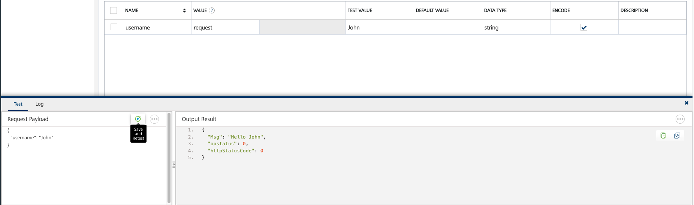
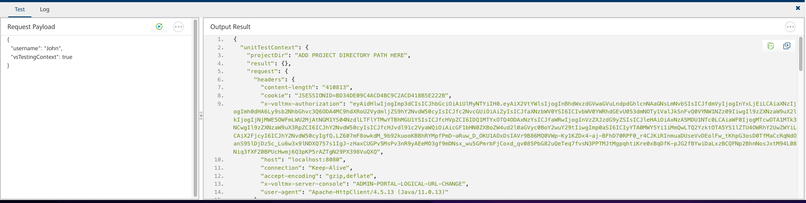

# Test and troubleshoot

Testing can be done in Volt Foundry or locally. Errors handling is added to the `Sub Initialize` in the Volt Foundry snippet.

To test locally, you will probably need the content object passed from Volt Foundry to VoltScript. Otherwise, the global objects won't be initialized in VoltMXObjects.vss, such as VoltMxRequest, VoltMxResult.

## Save And Fetch Response

The **SAVE AND FETCH RESPONSE** button at the bottom of an operation can be used to test an operation.

{: target="_blank" rel="noopener noreferrer"}

This will run the operation, using the test (if configured) or default values for any input parameters. The result will be displayed at the bottom of the screen.

{: target="_blank" rel="noopener noreferrer"}

!!! tip
    You can change the input parameters on-the-fly in the **Request Payload** panel and use the the **Save and ReTest** button to run with the new updates. **This doesn't take into account updates made to test values or default values in the main part of the operation**.

!!! note
    An environment needs to be set up and added to the operation, on the drop-down to the left of the **SAVE AND FETCH RESPONSE** button. The environment is set up on the **Environments** tab in the left-hand navigation.

### Understand the test panel

The test panel has two tabs, **Test** and **Log**. If an identity service is tied to the integration service, an additional tab, **Identity Backed Response** is added.

Identity Backed Response initially prompts the user to log into the identity service using the **AUTHORIZE** button. When authorized, the JWT token returned is displayed, along with buttons at the right-hand side of the panel to clear the token, copy the token or expand the panel.

Test shows the payload being sent with the request and the result that would be provided for the result.

Log shows the various steps in the process:

- **Request:** the payload being loaded by Volt Foundry, including any request input header or body parameters. Header parameters aren't relevant for VoltScript integration services.
- **Pre-Processor Output:** only shows if a preprocessor is added. This shows the modified payload after the preprocessor runs. This includes whether or not to continue execution, modified input parameters and result object.
- **Integration Service Input:** doesn't show for coded integration services. This shows the modified request sent to the integration service.
- **Integration Service Output:** doesn't show for coded integration services. This shows the response from the remote service.
- **PostProcessor Output:** only shows if a postprocessor is added. This shows the modified payload after the postprocessor runs. This includes input parameters and result object.
- **Response:** shows the response sent from Volt Foundry.
- **Miscellaneous:** shows performance and logs.

### Access Payloads for VoltScript

When you write a VoltScript integration service, there is boilerplate code that take a JSON string as contextual input and converts it to VoltScript objects using VoltMXObjects script library module. For unit testing or testing your local VoltScript code from REST clients like Postman, you need to know what JSON Volt Foundry passes across. The test panel allows you to access these JSON objects.

{: target="_blank" rel="noopener noreferrer"}

To do this, modify the payload to include a JSON element called `vsTestingContext` with the boolean value `true` and then click the **Save and Retest** button in the panel. With this in the request payload, the VoltScript code won't be executed. Instead, the Output Result will contain two JSON objects:

- **unitTestContext:** A JSON object that corresponds to `Context.context` from ContextVSE. This string can then be passed to `extractObjects()` function to create the Volt MX objects that would be created for a request via Volt Foundry. This will allow you to write unit tests to check various branches in your processing logic or troubleshoot your code locally.

    !!! note
        DrapiServer won't be automatically authenticated. Your unit tests will need to pass test credentials and login, passing the authenticated DrapiServer object to your code. This can be done in a `beforeEach()` or `beforeAll()` of a CustomBeforeAfterTester, see [Write code to BeforeAll, BeforeEach etc](https://opensource.hcltechsw.com/voltscript-testing/howto/BeforeAfterTester.html).

- **httpServerContext:** The actual JSON object Volt Foundry passes to VoltScript's HTTP server, including contextual data (`context`) and JWT token from identity service (`jwttoken`). This complete object can be passed from Postman to VoltScript's HTTP server. Testing this way will automatically extract the JWT token and authenticate the DrapiServer, assuming the JWT token is still valid. For more information, see Call VoltScript from Postman and tutorial.
<!-- TODO: Add pages and links -->

!!! warning
    For both JSON objects, you will need to update `projectDir` to your local project directory path, if you are using it in your VoltScript code. Alternatively, add logic to use `CurDir` under testing circumstances.

### Run locally from Postman

If the VoltScript runtime is started with the HTTP server (using --http-server option), you can also run the VoltScript script from Postman. The URL should be:

- **http://localhost:PORT/run**, where the port maps to the HTTP port VoltScript runtime's http server is started with. Port 9060 is the default.
- **?path=** plus the absolute path to the .vss file to run.
- **&seti_path=** plus the absolute path to the seti.ini file to use.

The Content-Type header should be set to "application/json". The body should contain the `httpServerContext` JSON object. For more details, see [Run HTTP server](../../running/http-server.md).