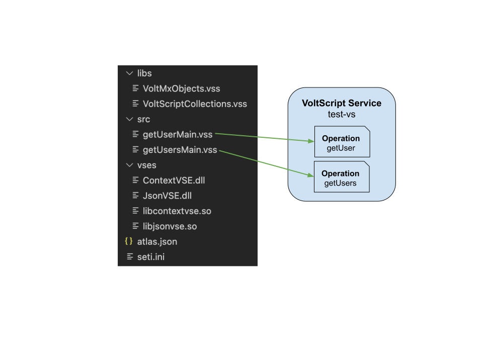

# Write and Package Integration Service Code

A VoltScript integration service is uploaded to Volt Foundry as a zip file containing source, libs and vses directories as well as seti.ini and atlas.json. Uploading both Windows and Linux versions of VSEs ensures the code can run on whatever platform Volt Foundry is installed. Each operation corresponds to a main script in the source directory in your VoltScript package.

!!! note
    Currently main scripts must be placed in a directory called `src`, which is also the default for `sourceDir` in the atlas.json.

1. Create the file atlas.json.
1. Type all or part of "foundry-atlas" and select the snippet.
1. Complete required fields and add any additional dependencies. **name** and **version** will be used to generate the zip file.
1. Run dependency management using **VoltScript: Install Dependencies** VS Code command.
1. Create a main script in `src` directory.
1. Type all or part of "foundry" and select the snippet. Enter your custom code in the block marked.
1. Add other main scripts as required.
1. Run Volt Foundry build management using **VoltScript: Package for Foundry** VS Code command.

The resulting zip can be uploaded to Foundry.

## Interacting with Volt Foundry context

The Volt Foundry contextual data is automatically parsed in the `extractObjects()` call. Content you may need will be:

| Object | Description |
| ------ | ----------- |
| PROJECT_DIR | Directory of this project on disk. Use this instead of `CurDir` when code should parse files uploaded with the project, because CurDir will be the directory of the VoltScript executable. |
| VoltMxRequest.getInputParam() | Access a request parameter mapped in **Request Input** body parameters. <!-- See [Configure request operation](./configuring.md#configure-request-operation) for more details. --> |
| VoltMxRequest.getRequestParam() | Access a request parameter not mapped in **Request Input** body parameters. |
| VoltMxRequest.getHeaderParam() | Access a header parameter |
| VoltMxRequest.getIdentityParam() | Access the JWT token from the identity service associated with this integration service. For talking to Domino via DrapiVSE, this is automatically passed to the `DrapiServer` object. For other backends, you need to parse the JWT token manually to retrieve whatever information you need to access the backend as the current logged on user. |
| VoltMxResult.opstatus | Integer property holding the opstatus to pass back from Volt Foundry, defaulting to 0. |
| VoltMxResult.httpStatusCode | Integer property holding the http status code to pass back from Volt Foundry, defaulting to 200. |
| VoltMxResult.result | JsonObject property for the response from Volt Foundry. |
| VoltMxResult.addDebugMessage() | Adds a message to debug out from Java to the Volt Foundry application logs, in the same way debug messages can be logged from Java or JavaScript integration services. Java logging level will need amending to output the logs. |
| VoltMxResult.setErrorMessage() | Sets an error message to be picked up by Volt Foundry, generating an exception for the operation. |

For more details, see documentation of [Volt MX Objects](https://opensource.hcltechsw.com/voltscript-voltmx-middleware/howto/writing.html)

## Write testable code

Writing custom code in the main script is sufficient for running in Volt Foundry. However, it makes the script harder to test. Recommended practice is to write your custom code in a function in a VoltScript Library Module, then call that from the main script. This allows you to write unit tests to check all potential scenarios for your REST service operation. <!-- See [Test and troubleshoot](./troubleshooting.md) for more details. -->