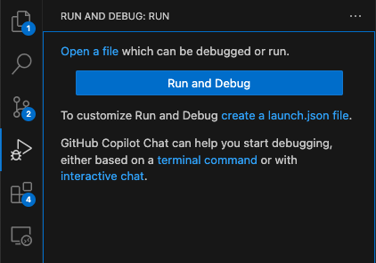

# Run from Visual Studio Code

An open VoltScript file can be run from the Command Palette, **VoltScript: Save & Run Script**. The standard VS Code keyboard shortcuts (Cmd + F5 / Ctrl + F5) will also work. An input box will be displayed to add any additional runtime parameters. For additional parameters, see [runtime options](./voltscript.md#options-available).

!!! note
    StreamVSE can be used to prompt for use input when running code. This is already in use with dependency management, where you are prompted for settings.

## Debugging

### Setting up launch.json

You can also debug code in VS Code. This can be done by going to the Run / Debug tab configuration and clicking **create a launch.json file**, using standard VS Code functionality.

{ style="width: 350px" }

The file will be created as launch.json in a `.vscode` directory. The content will default to:

```json
{
    // Use IntelliSense to learn about possible attributes.
    // Hover to view descriptions of existing attributes.
    // For more information, visit: https://go.microsoft.com/fwlink/?linkid=830387
    "version": "0.2.0",
    "configurations": [

        {
            "type": "voltscript",
            "name": "VoltScript - Run Active",
            "request": "launch",
            "pathToScript": "${file}",
            "scriptContext": "",
            "setiPath": "${workspaceFolder}/seti.ini",
            "stopAtEntry": true
        }
    ]
}
```

!!! warning
    VS Code will pop up a dialog to select a launch configuration. This appears over and covers the default configuration that gets created. Unless you specifically want to add another configuration, just click elsewhere on the screen and save the default launch.json file.

This will run the open script file (`"pathToScript": "${file}"`) looking for a seti.ini file in the root of the workspace folder (`"setiPath": "${workspaceFolder}/seti.ini"`). If your code is not using VSEs and you don't have a seti.ini, replace this value with an empty string. The code will break on the first line (`"stopAtEntry": true`). To just run the code without debugging, change `stopAtEntry` to false.

You can pass contextual data by pasting it into `scriptContext`, escaping any double quotes as required. This can be picked up with ContextVSE, see [Receive input](../extensions/input.md).

!!! warning
    The Debug Console cannot receive input, so you cannot debug code that uses StreamVSE to prompt the user for input. You will need to modify your script accordingly, for example passing a value in `scriptContext` to tell your script to use hard-coded content instead of prompting the user for input.

### Additional configurations

Two other VoltScript configurations are available:

- VoltScript: Launch (Local)
- VoltScript: Launch (Remote)

They can be added by using content assist in the launch.json or clicking the launch configuration drop-down on the Run / Debug tab and selecting "Add configuration...". Scroll down the dialog box that appears to find the additional configurations.

#### VoltScript: Launch (Local)

This configuration is for running a specific script from VS Code. If you just want to run the currently open script, use the default configuration instead.

`stopAtEntry` defaults to true. You will need to manually complete the `pathToScript`, `scriptContext`, and `setiPath` values. Use variables as required, e.g. `${workspaceFolder}` for the current workspace folder. For more details of variabvles available, see [Variables Reference documentation](https://code.visualstudio.com/docs/reference/variables-reference).

#### VoltScript: Launch (Remote)

This configuration is for running a specific script using VoltScript's [HTTP server](./http-server.md#debugging). This can be useful for debugging code for Foundry using a payload previously extracted from Foundry.

`stopAtEntry` defaults to true. You will need to manually complete the `pathToScript`, `scriptContext`, `setiPath`, `serverPort`, and `serverHost` values as required. Full paths will be required for `pathToScript` and `setiPath`, because these are used by the HTTP server, not VS Code.

### Using the debugger

For details on using VS Code's debugger, see the [standard VS Code debugging documentation](https://code.visualstudio.com/docs/debugtest/debugging), with the following caveats:

- The only breakpoints supported are:
    - Standard breakpoints.
    - Triggered breakpoints.
    - Inline breakpoints.
- Function breakpoints, data breakpoints, and logpoints are not supported.
- Variable values can be updated, including array elements.
- Array bounds cannot be dynamically changed in the Variables panel.
- Strings values display in quotes. When setting a value, remove the quotes: the inputted value will be wrapped in quotes.
- The Watch section is not supported.
- Debug Console REPL is not supported.