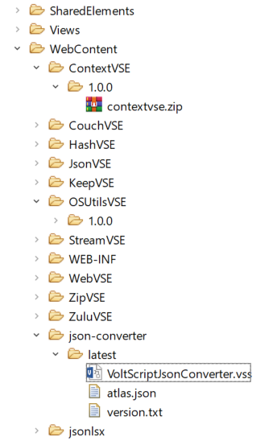

# Publish to GitHub or a web server

Voltscript Build Manager currently supports two types of repository - **GitHub** and generic web servers that allow downloading content via a standard folder structure.

## Publishing to GitHub

If publishing to GitHub, VoltScript's build manager will pull files from a release in a repository using standard GitHub APIs. For "latest" GitHub automatically redirects and knows which is the latest version, and the GitHub API returns the actual version number, so no additional work is required.

!!!note
    Make a note of your **repository** name. This will be the **library** you need to pass to consumers.

When ready, create a [Release](https://docs.github.com/en/repositories/releasing-projects-on-github/about-releases){: target="_blank" rel="noopener noreferrer"}. The tag you give the release, for example "1.0.0-RC1", will be the **version** you need to pass to consumers. The source code will automatically be created on the release. In addition, add the packaged files for the [VoltScript Extension](vses.md) or [VoltScript Library](libraries.md). You don't need to include `.vss` files or extensions from other external repositories, VoltScript build manager will automatically download those. However, if there are additional `.vss` files custom for this repository, you will need to include those.

Regardless of whether the repo is public or private, users will need to set up a [Personal Access Token](https://docs.github.com/en/authentication/keeping-your-account-and-data-secure/creating-a-personal-access-token){: target="_blank" rel="noopener noreferrer"} to pull down the release artifacts.

## Publishing to a generic web server

When downloading from a web server, VoltScript Build Manager will build a URL using LIBRARY/VERSION/MODULE. To support "latest", your web server will need the latest version in two directories, one called "latest" and one with the actual version number. In addition, the "latest" directory will also need to include a file with the name `version.txt`, which includes just the actual current version number. This should be updated as you release a new version. So the `version.txt` file will just be, for example:

```json
1.0.0
```

### Publishing to Domino

Domino can be used as a generic web server repository, either putting the files directly on the server or in an NSF.

When put directly on the server, create a directory structure using LIBRARY/VERSION and put the modules and atlas.json in this directory. Anything prior to this will be the repository URL.

When put in an NSF, you can either:

- Use File Resources, where the filename is LIBRARY/VERSION/MODULE. Its `atlas.json` would be LIBRARY/VERSION/atlas.json. If VERSION is latest, you would also need a LIBRARY/latest/version.txt file resource.
- In Package Explorer view, right-click the WebContent directory and create a folder with the library name. Right-click that directory and create a folder for the version name. Then drag or paste your modules into that folder.



#### Ensuring correct HTTP response codes

You can use basic authentication, even if session authentication is enabled for the server. However, by default, if authentication fails, you get an HTTP 200 result with a login page. This isn't what you want for REST API access. This can be circumvented by using a "Overrides Session Authentication" Web Site Rule document. For more information, see [Authenticating a DAS Request from Other Types of Applications](https://ds-infolib.hcltechsw.com/ldd/ddwiki.nsf/dx/Authenticating_Domino_REST_Service_Requests#Authenticating+a+DAS+Request+from+Other+Types+of+Applications){: target="_blank" rel="noopener noreferrer"}.

In Domino Directory, go to **Configuration** &rarr; **Messaging** &rarr; **Internet Sites**. Ensure there is an Internet Site document for the server. Open it up. Click **Web Site** &rarr; **Create Rule**. Add a description, as appropriate. Change the **Type of rule** to **Override Session Authentication**. Set the **Incoming URL pattern** to an appropriate path for the requests, for example `*/VSRepo.nsf/*`.

### Requiring authentication

VoltScript Build Manager supports generic web servers that are secured for basic authentication. If credentials are found for a matching repository ID, they're added to the Basic Authentication header.