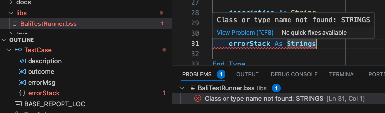

# Visual Studio Code IDE

The intended IDE (Integrated Development Environment) for VoltScript projects is Visual Studio Code. To support development, two Visual Studio Code Extensions are provided:

- **VoltScript Language Support** provides core language functionality - compilation, problem notification, syntax symbols.
- **VoltScript Build Management** provides dependency management functionality.

## Code View

VoltScript code is validated as you type. Errors are displayed in various context:

- The text is highlighted with a red "squiggle" underline.
- A message is displayed in the Problems view.
- The file is marked in red in the Explorer view.
- The relevant symbol is highlighted in red in the **Outline** view.

### Code Snippets

Code snippets are provided for VoltScript. Note that code snippets look for a prefix, one or more trigger words that are substring-matched against what's typed.

!!! info
    Regex can't be used for Visual Studio Code snippet prefixes, so "If" will match `If` and `End If`. The character set is also limited, so for `%REM` the snippet prefix is just "REM".

By default, snippet suggestions are accepted with the **Enter** or **Tab** key. This can be changed in **Preferences** &rarr; **Settings** by changing the **Accept Suggestion on Enter** setting under **Text Editor** &rarr; **Suggestions**.

!!! note
    Content assist doesn't yet integrate with core language functions and keywords, VoltScript Extension classes or VoltScript Libraries. The out-of-the-box Visual Studio Code content assist will offer suggestions based on open files. Hover documentation isn't yet available.

There is a specific code snippet for Volt Foundry boilerplate code, accessed via `foundry`. For more details, see [Volt Foundry script boilerplate](../foundry/integrations/archipelago.md#volt-foundry-script-boilerplate).

## Outline View

Symbols (Classes, Types, Methods, Properties, Variables) are identified in the **Outline**.

!!! note
    If the code can't be compiled, outline symbols can't be extracted.

!!! info
    The Visual Studio Code **Outline** view automatically contributes a button to collapse all symbols. Alternative, sorting options are available by clicking on the ellipsis (...).

## Command Palette

Three Command Palette commands are contributed by the Visual Studio Code extensions:

- **VoltScript: Save & Run Script** has a shortcut code F5 and is only available when editing a `.vss` file.
- **VoltScript: Run Dependency Setup** validates or creates the `.vss` directory in the user's home directory and is only available when editing an `atlas.json` or `atlas-settings.json`.
- **VoltScript: Install Dependencies** prompts for project directory, `atlas.json`, `atlas-settings.json`, and whether to force download of dependencies. This is only available when editing an `atlas.json` or `atlas-settings.json`.

## Terminal

The integrated **Terminal** also provides the ability to run code from command line.

## Debugger

Debugging is available. For more details, see [debugging](../running/vscode.md#debugging).