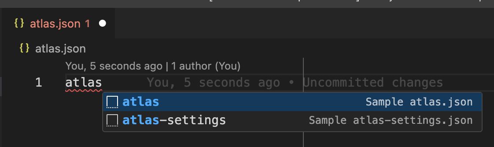
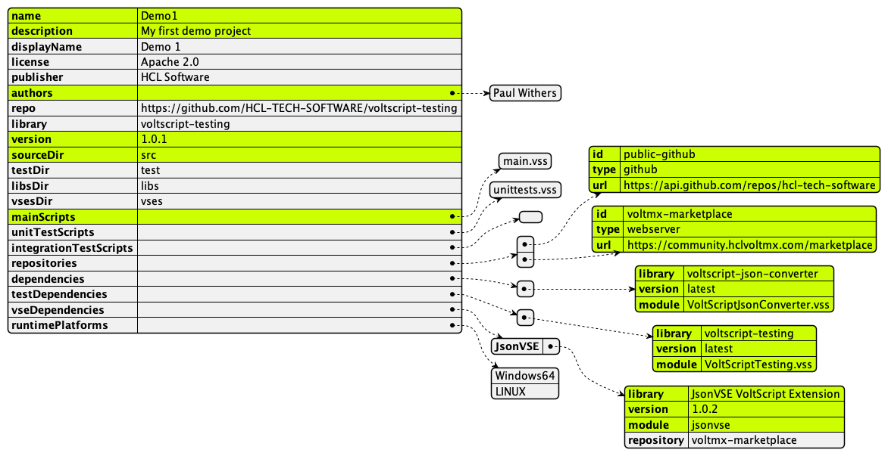
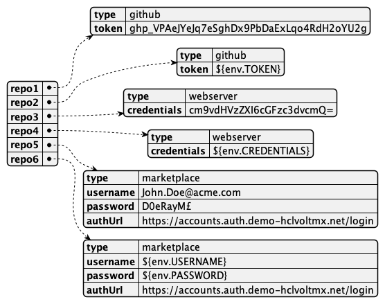

<!---
hide:
    toc
--->
# atlas.json and atlas-settings.json schemas

The VS Code extension will validate both the `atlas.json` and `atlas-settings.json` for you. There are snippets available for populating a commented sample of all valid options, which can be retrieved by typing "atlas" or "atlas-settings".

{ style="width: 500px" }

## atlas.json

### Sample structure

!!!note
    Required properties are highlighted.

### Detailed description

|Property|Required|Description|
|:----|:----:|:----|
|name|&check;|name of your project|
|displayName||user-friendly name for the project|
|description|&check;|verbose description of what your project does|
|authors|&check;|an array of names of developers for the project|
|license||license under which you wish the project to be available|
|publisher||owner of the project, typically your company name|
|repo||where the course code can be accessed|
|library||group name for the project  If stored on GitHub, this would be the repository name.|
|version|&check;|current version for the project  [Semver](https://semver.org/){: target="_blank" rel="noopener noreferrer"} format is recommended.|
|sourceDir|&check;|directory where main runnable VoltScript files will be stored  If you wish to place such files in the root of the project, use an empty string ("").|
|testDir||directory where unit and integration test runnable VoltScript files will be stored  This can be omitted if tests are being put in the root.|
|libsDir||directory where [VoltScript Libraries](./libraries.md) (.vss files) will be stored   This can be omitted if they will be put in the root.|
|vsesDir||directory where [VoltScript Extensions](./vses.md) will be stored  This can be omitted if they will be put in the root.|
|mainScripts|&check;|an array of files that are main runnable scripts.|
|unitTestScript||an array of files that are unit test runnable scripts.|
|integrationTestScripts||an array of files that are integration test runnable scripts.|
|repositories|&check;|an array of **repository** objects, each containing the following properties:  - **id**: Use to cross-reference with the `atlas-settings.json`.  - **type**: Currently, only "github", "webserver", and "marketplace" are supported.  - **url**: base URL for API calls to the repository.|
|dependencies|&check;|an array of **dependency** objects mapping to VoltScript files to use. The dependency contains three properties:  - **library**: The group under which the `.vss` files and their own `atlas.json` are grouped.  - **version**: an explicit version number mapping to a release, or "latest" to also retrieve the most recent  - **module**: the specific file to be incorporated  - repository: an optional property mapping to a repository ID If used, Archipelago will look in that repository first.|
|testDependencies|&check;|an array of **dependency** objects mapping to VoltScript files only for use in unit and integration tests. The dependency structure if the same as for **dependencies**|
|vseDependencies|&check;|an object of **extension dependency** objects mapping to extensions to use. The extension dependency is a JSON object whose label is the name you intend to use in the `UseVSE` statement, and which has the following properties:  - **library**: the group under which the VoltScript Extension(s) are grouped. For Volt MX Marketplace, this is VSE title on the marketplace, e.g. "JsonVSE VoltScript Extension". - **version**: a human-readable version corresponding to an asset version on Volt MX Marketplace. "latest" is not supported.  - **module**: the specific filename to be downloaded. For Volt MX Marketplace, this will be the asset filename without the extension, e.g. "jsonvse".|
|runtimePlatforms||**only relevant is vseDependencies is set**. An array of platforms for which to copy VSE dependencies into the project. If omitted or an empty array, the VSE files for all platforms will be copied into the project. If defined, only the VSE files for the relevant platforms will be used.  For example, if the array is ["Windows64"] only the .dll files for each VSE will be copied into the project and the code can only be run and deployed to a Windows server.  Valid options are: **Windows64**, **LINUX**, **MACOS**. Mac dylibs can and have been cross-compiled for both Intel and ARM processors, so only a single platform option is required for MacOS. Currently only Linux-x64 is supported, a future release will add Linux-aarch64 support and a separate option.|

!!!note
    If you have the VoltScript Build Manager extension installed, validation in Visual Studio Code ensures your `atlas.json` is valid. Typing "atlas" allows you to pull in a snippet providing all possible options and comments.

## atlas-settings.json

### Sample structure

Within each repository JSON object, **all properties are required**.

### Detailed description

The label for each settings JSON object should be the id used for that repository in the `atlas.json`. The schema for each settings object is:

|Property|Required|Description|
|:----|:----:|:----|
|type|&check;|either "github", "webserver", or "marketplace|
|token|&check;|only accepted where `type` is "github"  This is the [GitHub Personal Access Token](https://docs.github.com/en/authentication/keeping-your-account-and-data-secure/creating-a-personal-access-token){: target="_new" rel="noopener noreferrer”}.|
|credentials|&check;|only accepted where 'type' is "webserver"  a Base64-encoded string of the username + ":" + password|
|username|&check;|only accepted where 'type' is "marketplace"  The username to log into Volt MX Marketplace|
|password|&check;|only accepted where 'type' is "marketplace"  The password to log into Volt MX Marketplace|
|authUrl|&check;|only accepted where 'type' is "marketplace"  The login URL for Volt MX Marketplace, https://accounts.auth.demo-hclvoltmx.net/login|

--8<-- "atlas-settings-sample.md"

!!!warning
    The `atlas-settings.json` is a JSON object of settings for repositories in an `atlas.json`. As a result, you won't get content assist at the top level. You'll only receive content assist for each settings JSON object. Typing "atlas-settings" enables you to pull in a snippet providing all possible options and comments.

See [Using VoltScript Build Manager](../howto/archipelago/index.md) for more details.