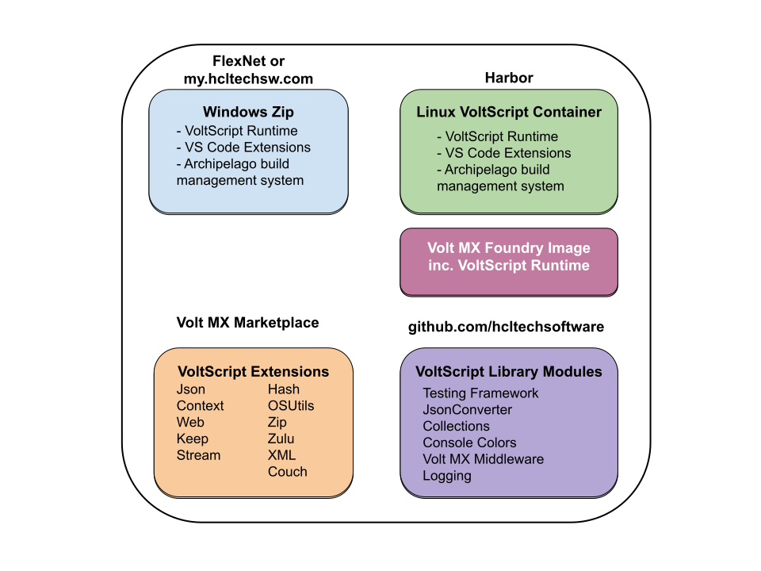

# VoltScript Components

VoltScript comprises multiple components delivered via different methods. This can be confusing. This page aims to demystify what comes from where, for which audience, for what purpose.

## Download / Retrieval Locations

| Location                   | Artefact      | Purpose        |
|----------------------------|---------------|----------|
| [My HCLSoftware](https://my.hcltechsw.com/){: target="_blank" rel="noopener noreferrer"} | Windows zip   | Develop VoltScript on Windows Run standalone VoltScript code on Windows |
| Harbor                     | Linux Container Image | Develop VoltScript on  Intel Mac / Linux |
| Harbor                     | Volt Foundry Container Image | <!--**New for EA3-->Upload or code VoltScript integration services on Volt Foundry |
| Volt MX Marketplace        | VoltScript Extensions | Provides closed-source low-level functionality Add via build management Import into VoltScript integration service zip |
| HCL GitHub org             | VoltScript Library Modules | Provides open source helpers Add via build management Download from Releases and upload to VoltScript integration service zip |

## Audience

### Administrators

Administrators will only require the Volt Foundry container image. This is an early access version of Volt Foundry that includes VoltScript integration services.

!!! warning
    The Volt Foundry container image should only be used for evaluation of VoltScript integration services. It may include in-development work on other aspects of Volt MX Go. **Support is via Volt MX Early Access Forum and will only be provided on VoltScript integration services.**

!!! note
    As with Volt MX Go early access program, only a containerized image of Volt Foundry is provided.

### Developers

Developers' starting point will depend on their development approach:

- For developers wishing to develop VoltScript code locally:
    - On Windows, download the Windows zip and follow instructions in the [relevant tutorial](../tutorials/ide/windows.md).
    - On Intel Mac, download the Linux container image and follow instructions in the [relevant tutorial](../tutorials/ide/devcontainer.md).
- For developers wishing to write their code directly into a Volt Foundry, download the Volt Foundry container image and follow instructions in the [relevant tutorial](../tutorials/foundryinstall/index.md).

!!! note
    - VoltScript integration service projects can be coded locally and uploaded into Volt Foundry, or they can be coded directly into Volt Foundry. Better IDE integration is currently possible with local development on Visual Studio Code, plus the ability to write and run unit tests. If you know the APIs and are willing to accept that compile-time errors are only exposed at runtime, developing directly on Volt Foundry may be quicker.
    - A container image is not currently available for ARM-based Mac. The Linux container image for Intel Mac may work, but is unsupported.
    - As with Volt MX Go early access program, only a containerized image of Volt Foundry is provided.

#### VoltScript Extensions

Developers should not download the VoltScript extensions from the Volt MX Marketplace. However, you will need credentials for Volt MX Marketplace, see [Volt MX Marketplace how-to](../howto/archipelago/settings.md#volt-mx-marketplace-credentials).

For locally-based development, the [Archipelago build management](../howto/archipelago/index.md) system should be used to pull down extensions.

For development directly on Volt Foundry, you can import directly from the Volt MX Marketplace. You will prompted for the username and password for Volt MX Marketplace.

#### VoltScript Library Modules

For locally-based development, the [Archipelago build management](../howto/archipelago/index.md) system should be used to pull down VoltScript Library Modules. This will automatically pull in downstream dependencies.

For development directly on Volt Foundry, you will need to download the scripts from the Releases area of the relevant repo, then upload to Volt Foundry. You will need to ensure you pull in the relevant dependencies, which can be confirmed by looking at the relevant atlas.json.