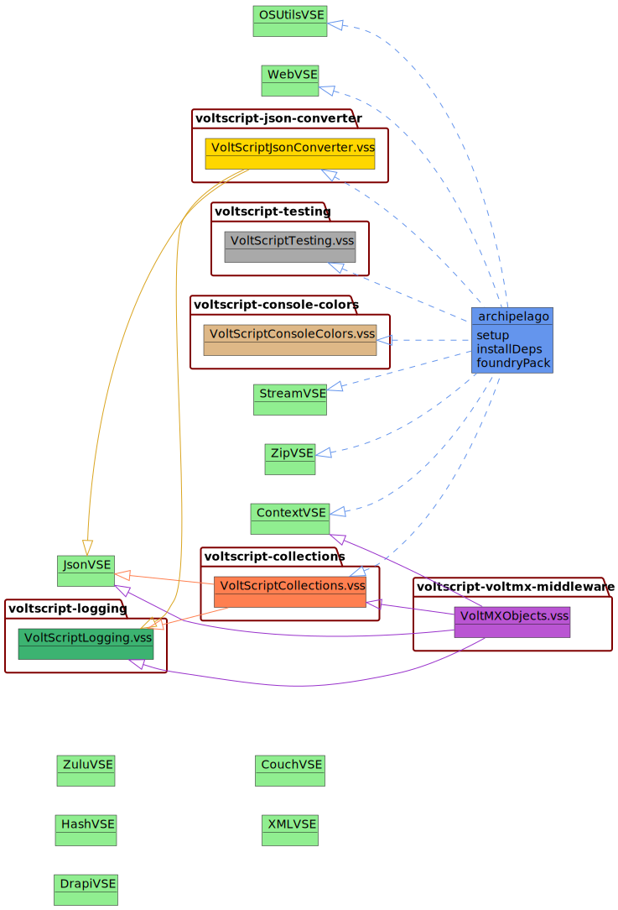

---
hide:
    toc
---
# Dependency Map

The following diagram shows dependency map between dependency management script (archipelago), VoltScript Library Modules and VoltScript Extensions:

<!-- NOTE: Using plantuml for class diagrams. MermaidJS is an old version that doesn't support styling on class diagrams, so doesn't work well. -->

All VoltScript Extension and VoltScript Library Module repositories depend on VoltScript Testing for unit tests. But these are just used as test dependencies, not compile-time dependencies.