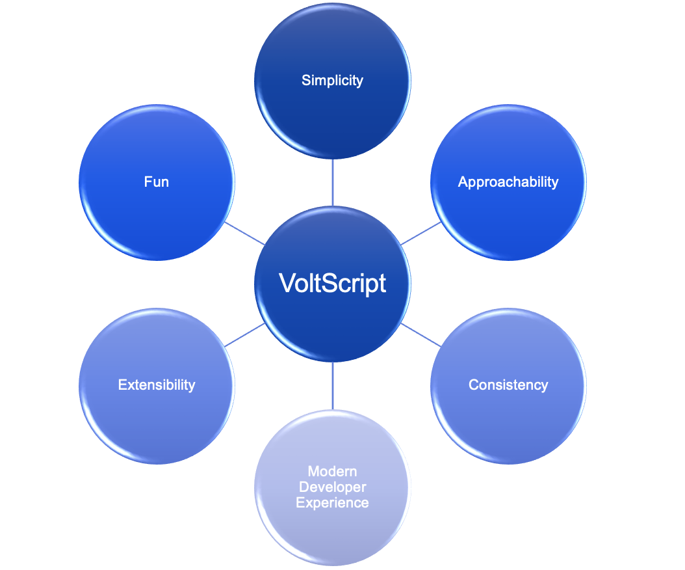

# Architectural considerations

The core priorities when evolving VoltScript have been:

- **Simplicity**: VoltScript is designed for writing quick, effective, powerful middleware functions. It's not intended to provide low-level memory and thread management. Async processing will predominantly be handled by the middleware layer it runs on. VoltScript is intended for middleware projects that go from spec to production in days or weeks, not months or years.
- **Approachability**: LotusScript was adopted because it was approachable for the citizen developers who embraced the Lotus Notes platform. The target audience is developers who want to get things done and move on to the next task, writing code that minimizes gotchas and is easily understandable.
- **Consistency**: Where appropriate, VoltScript has been modified with syntactical changes and structures that are consistent with approaches adopted across other and younger languages.
- **Modern Developer Experience**: The VoltScript language is being supplemented by tooling and constructs to bring software development IDE functionality and processes that are standard across the industry.
- **Extensibility**: Extensibility is at the heart of VoltScript, both for VoltScript developers and C/C++ developers. To build a thriving community, the contribution and consumption of code by a wide audience is required.
- **Fun**: Last but by no means least, coding in VoltScript should be fun, not frustrating, with as many successful outcomes as possible.