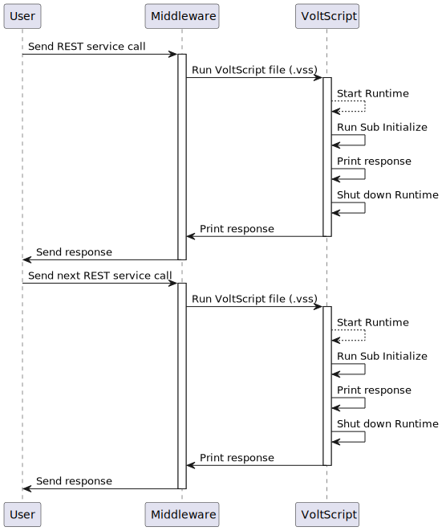

# Considerations when using VoltScript as middleware

There are some functions and statements not supported in VoltScript, and these are covered in the [Reference](../references/unsupported.md)

## Understanding Middleware

There is no VoltScript server. The VoltScript runtime is started for each call with no retained in-memory variables or objects. At the end of that call, all in-memory variables and objects are removed and the runtime shut down. Each call is discreet and stateless.

It's also important to emphasize that VoltScript won't be running wherever the UI is. Therefore, a separate call will be required between each user interaction.

!!! note
    In Domino development, a single event (such as QuerySave of a Form) is a single block of LotusScript including multiple steps each separated by requests for a user response. LotusScript runs in the Notes Client and can prompt for user interaction _in the middle of a single block of code_.

    When converting that kind of process to middleware, it's important to understand that the single module of code is actually multiple separate processes. VoltScript as middleware is more analagous to Web Query Save agents. If the desire is to use VoltScript, either all user responses need to be available at the start or the code needs breaking into multiple REST services. The alternative is to convert as much as possible into a front-end coding language (e.g. JavaScript) and use VoltScript for only the non-interactive elements.

## MessageBox

VoltScript in Volt MX Go runs as middleware, so functions that require direct user interaction should be avoided. The `--headless` option can be used to convert `MessageBox` statements to Print statements.

## Static Keyword

The `Static` keyword in LotusScript can be used for [Variables](https://help.hcltechsw.com/dom_designer/12.0.2/basic/LSAZ_DIM_STATEMENT.html), [Properties](https://help.hcltechsw.com/dom_designer/12.0.2/basic/LSAZ_DECLARING_AND_DEFINING_PROPERTIES.html), [Functions](https://help.hcltechsw.com/dom_designer/12.0.2/basic/LSAZ_DEFINING_A_FUNCTION.html), and [Subs](https://help.hcltechsw.com/dom_designer/12.0.2/basic/LSAZ_DECLARING_AND_DEFINING_SUBS.html). Static indicates that variables should retain their values between calls while the current module remains loaded.

In HCL Notes&reg; and Domino&reg;, modules can remain loaded beyond a single operation by the user. In VoltScript, each user- or system-triggered process is stateless. As a result, the benefits of using the `Static` keyword are fewer than in LotusScript.

## Communication protocols and performance considerations

Certain points should be borne in mind for middleware:

- Typically, middleware code is acting on a request from the user and retrieving or updating data in some remote database.
- Usually, the communication both with the user and to the remote database will be over HTTP.
- Usually, the incoming request will have some timeout included.

If dealing with a single small chunk of data, this distinction may not be important. However, in other scenarios, the impact on performance may be considerable:

- When updating one document, it's common to update multiple related documents in the same call. When this code is running in the same location as data, multiple calls to the database are fast to get the next document, update an item and save to disk. When the code is running elsewhere, those multiple network calls will have an exponential impact on the performance. In addition, for each network call the data will need to be converted from received format to VoltScript objects and back to a different format for making the update. If there are proxy servers in between, the impact will be more significant.
- When processing large amounts of data, the data needs to be collected at the database layer, sent over some network protocol (often HTTP/S), received, converted and processed. After that, the data is sent to the user interface over another network protocol, typically HTTP/S, where it needs to be received, converted and processed. Performance will be impacted.

As a result, receiving and manipulating large quantities of data in the middleware layer isn't recommended.