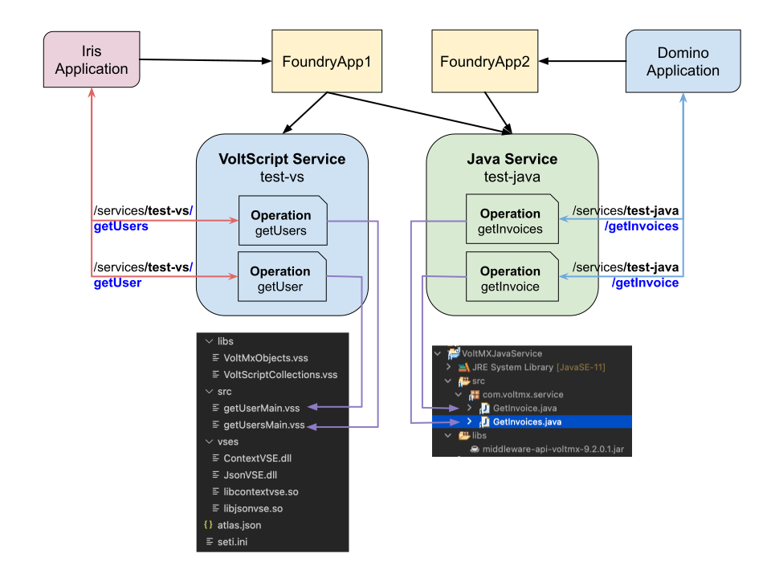

# Integration Services in Volt Foundry

An **integration service** is a Volt Foundry component that represents the application interaction with an external system or data source. Each integration service uses a specific technology or business adapter, such as JSON, Java, VoltScript, SAP Gateway, MongoDB, Salesforce. An integration service defines **Operations**, which are sub-components that represent each REST endpoint. One or more Integration services are published together through an **App**. But the external URI uses the integration service name and the Operation name.

For VoltScript, each operation maps to a .vss file in `src` directory of the zip file. The approach is the same as for Java, where each operation maps to a Java class in the JAR file.

For more details on integration services in Volt MX, see [Integration Overview](https://opensource.hcltechsw.com/volt-mx-docs/95/docs/documentation/Foundry/voltmx_foundry_user_guide/Content/Services.html){: target="_blank" rel="noopener noreferrer"}.