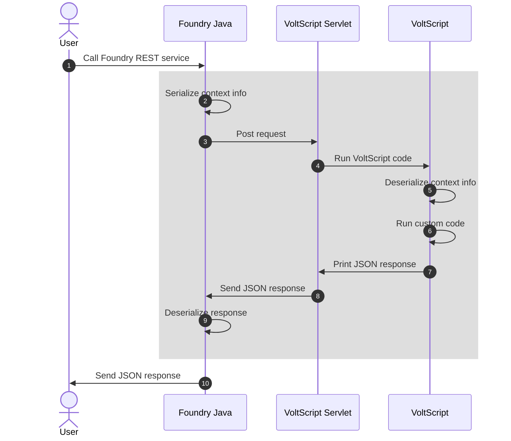

# VoltScript in Volt MX Go

!!! note

    LotusScript in HCL Notes and Domino is a server-side (Domino) and client-side (Notes) language. VoltScript is only a server-side language running in Volt Foundry.

## Integration services

HCL Volt Foundry uses integration services for connecting to remote services or running custom code via technology or business adapters. In HCL Volt MX, the technology adapters for running custom code are:

- **Volt MX Mock Data Adapter** for generating mock data.
- **Java Adapter** for running custom Java code from an uploaded JAR file. Operations run a Java class implementing the JavaService2 interface.
- **JavaScript Adapter** for running functions in a custom JavaScript code from an uploaded JavaScript file. There are certain [limitations](https://opensource.hcltechsw.com/volt-mx-docs/95/docs/documentation/Foundry/voltmx_foundry_user_guide/Content/JavaScript_Adapter.html#limitations-for-javascript-engine-javascript-adapter){: target="_blank" rel="noopener noreferrer"}.

In Volt MX Go, VoltScript is added as an additional custom code language.

{style="height:250px"}

## Preprocessors and postprocessors

Integration services also permit custom code invocation before (preprocessor) and/or after the main integration service. In Volt MX there are three options:

- **Java** for running custom Java code from an uploaded JAR file. Preprocessors run a Java class implementing the DataPreProcessor interface. Postprocessors run a Java class implementing the DataPostProcessor interface.
- **JavaScript** for running custom JavaScript code entered into the Monaco editor.
- **Rules** for running custom logic using MVFLEX Expression Language (MVEL).

In Volt MX Go, VoltScript is added as an additional custom code language for preprocessors and postprocessors. However, only small snippets of code are expected, for example to validate input parameters or manipulate the output. As a result, VoltScript code is entered directly into the Monaco editor, and merged into boilerplate VoltScript.

{style="height:500px"}

!!! info

    Note the final two lines, both `Return True` and `End Function` are automatically appended.

!!! note

    VoltScript pre/postprocessors are not available for VoltScript integration services. This is a limitation for performance reasons, see below.

## How Volt Foundry runs preprocessors and postprocessors

The sequence flow for running preprocessors and postprocessors is:

For more information, see [Workflow of Integration Services](https://opensource.hcltechsw.com/volt-mx-docs/95/docs/documentation/Foundry/voltmx_foundry_user_guide/Content/Services.html#workflow-of-integration-services){: target="_blank" rel="noopener noreferrer"}.

## How Volt Foundry runs VoltScript

Integration with the VoltScript runtime is via the multi-threaded HTTP server, the equivalent of `VoltScript --httpserver`.

!!! note
    Obviously, for a VoltScript integration service, it's inefficient to call repeat the process in the shaded area multiple times for a VoltScript preprocessor and/or postprocessor. The best practice is to include any preprocessing or postprocessing of content within the main VoltScript integration service code.