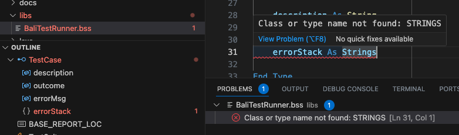

# Writing VoltScript code

## .vss File and Structure

The file suffix for VoltScript code is `.vss` (similar to `.lss`, the suffix for LotusScript). The `Sub Initialize` of all files and all dependencies will be run. Also any code outside of a sub or function will be run. However, best practice is to structure your file so `Sub Initialize` is the entrypoint.

## Standalone Script File (.vss)

VoltScript code can be written and run as a single self-contained file, where the only external calls are to core language data types and functions. But this is only advisable for small scripts to run quick actions.

## VoltScript Projects

In practice, most code will use external classes or methods either in other `.vss` files (VoltScript Library Modules) or VoltScript Extensions (`.dll` or `.so` files written in C/C++). [VoltScript's build manager system](../howto/archipelago/index.md) is designed to pull those external dependencies from either GitHub or a web server repository. The **atlas.json** file is used to define the structures of your project and its dependencies.

See [How to Structure Your Project](../howto/writing/structure.md) for more details.

See [How to Use Build Manager](../howto/archipelago/index.md) for how it will create your project structure and build dependencies.

## IDE

The target IDE for writing complex VoltScript projects is Visual Studio Code on [Windows](../howto/writing/vscode.md) or [Mac](../tutorials/ide/devcontainer.md). There are two Visual Studio Code extensions for VoltScript:

- **VoltScript Language Support** includes all functionality to write, compile, and run VoltScript code in Visual Studio Code.
- **VoltScript Build Manager** includes the functionality for dependency management, project directory structuring, and build manager.

## VoltScript Language Support extension

The VoltScript Language Support extension provides language features to Visual Studio Code.

- VoltScript language is automatically detected for `.vss` files.
- Syntax highlighting is provided for VoltScript.
- VoltScript code is validated as you type. Errors are displayed in various context:
    - The text is highlighted with a red "squiggle" underline.
    - A message is displayed in the Problems view.
    - The file is marked in red in the Explorer view.
    - The relevant symbol is highlighted in red in the Outline view.
      
- Code snippets are provided for VoltScript. Note that code snippets look for a prefix, one or more trigger words that are substring-matched against what's typed. Regex can't be used for code snippet prefixes, so "If" will match `If` and `End If`. 

    !!!note
        By default, snippet suggestions are accepted with the `Enter` or `Tab` key. This can be changed in **Preferences**&rarr;**Settings** by changing the **Accept Suggestion on Enter** setting under **Text Editor**&rarr;**Suggestions**.

- Symbols (Classes, Types, Methods, Properties, Variables) are identified in the Outline. 

    !!!note
        If the code can't be compiled, outline symbols can't be extracted.

- **atlas.json** and **atlas-settings.json** files are validated for correct JSON syntax, with content assist.
- **VoltScript: Save & Compile Script** is a Command Palette option with the shortcut code Ctrl + B / Command + B.
- **VoltScript: Save & Run Script** is a Command Palette option with the shortcut code F5.

## VoltScript Build Manager extension

The VoltScript Build Manager extension provides Command Palette options for running setup and installing dependencies. These call the VoltScript_Archipelago command line tool provided with VoltScript.

- On startup, if there is an `atlas.json` file in the workspace folder, `VoltScript_Archipelago setup` will be triggered in the integrated Terminal.
- **VoltScript: Run Dependency Setup** validates or creates the `.vss` directory in the user's home directory.
- **VoltScript: Install Dependencies** prompts for project directory, `atlas.json`, `atlas-settings.json` and whether to force download of dependencies.

Functionality in the extensions will continuously evolve.