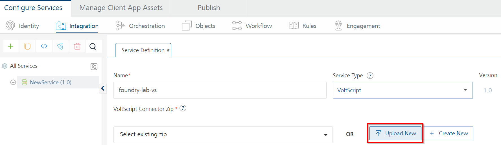
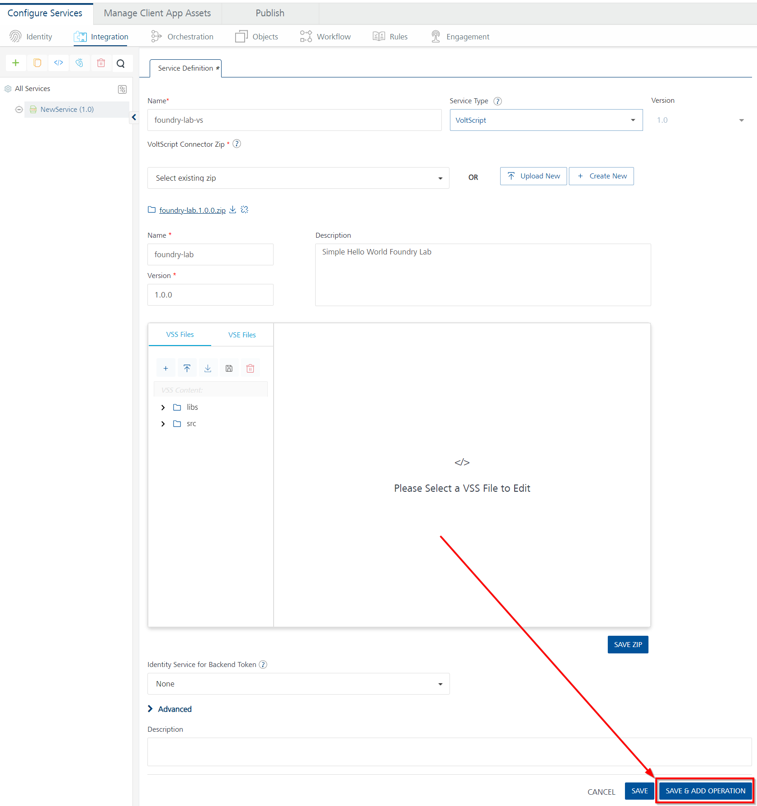
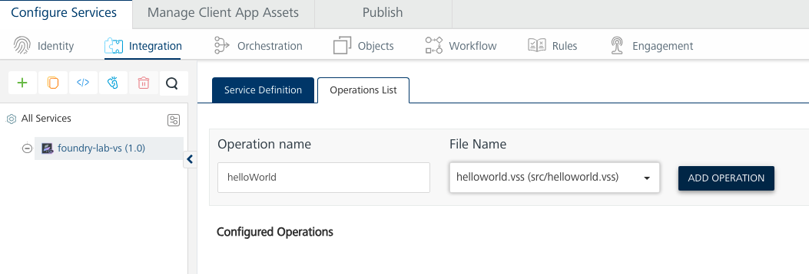
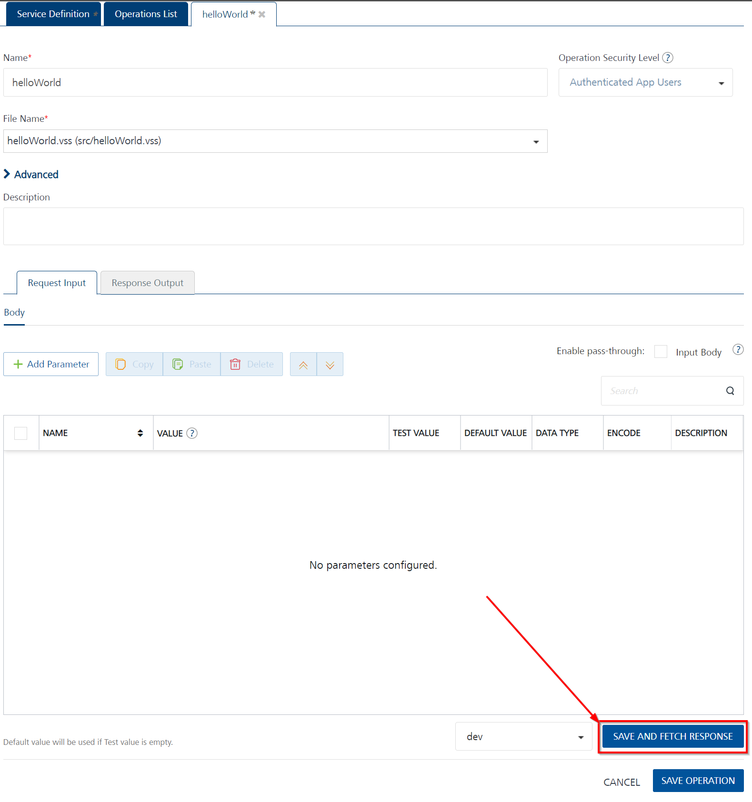

# Foundry Lab 01 - Hello World Integration Service

## Duration 20 Min

## What you will learn

You'll learn how to create a simple integration service to return a JSON object including a **message** element that says "Hello World".

## Prerequisites

- This exercise assumes you are familiar with dependency management, as covered in [Intro to VoltScript Lab 03a](../walkthrough/lab-03a.md).

## Steps

### atlas.json

1. Click **File** &rarr; **Open Folder**.
1. Create a new folder in your user directory called "foundry-lab".
1. Right-click in the empty pane and select **New File** from the context menu.
1. Name the file "atlas.json".
1. Type "foundry-atlas" and accept the snippet.
1. Set name to "foundry-lab".
1. Set description to "Simple Hello World Foundry Lab".
1. Set displayName to "foundry-lab".
1. Complete publisher and authors.
1. Delete repo and library elements.
1. Set version to "1.0.0".
1. Change array element in mainScripts to "helloWorld.vss"
1. Add the usual repositories to the **repositories** array for [VSEs](../../references/vses.md#repository) and [Library Modules](../../references/libraries.md#repository).
1. In **dependencies** array, add VoltScript VoltMX Middleware:
    1. Set library to "voltscript-voltmx-middleware".
    1. Set version to "latest".
    1. Set module to "VoltMXObjects.vss".
    1. Set repository to "hcl-github".
1. Delete unitTestScripts, integrationTestScripts, testDependencies, and vseDependencies elements.
1. Save the atlas.json.

    ???example "The final atlas.json should look like this:"

        ```json
        {
            "name": "foundry-lab",			// REQUIRED: Enter a short name for your VoltScript project, e.g. "Demo1"
            "description": "Simple Hello World Foundry Lab",	// REQUIRED: Enter a longer description, e.g. "My first demo project"
            "displayName": "foundry-lab",  // A longer name to refer to the project, e.g. "Demo 1"
            "license": "Apache 2.0",	// A license to publish the project under.
                                        // If you want this to be used by others, Apache 2.0 or MIT are recommended
            "publisher": "HCL America, Inc.",	// Copyright owner
            "authors": [		// REQUIRED: An array of authors, can be names or emails
                "Paul Withers"
            ],
            "version":"1.0.0",	// REQUIRED: Current version for this project, used with dependency management to find the modules
            "sourceDir": "src",	// REQUIRED: Directory where mainScripts are located
            "testDir": "test",	// Directory where unitTestScripts and integrationTestScripts are located
            "libsDir": "libs",	// Directory where VoltScript Library Modules and shared scripts are located
            "vsesDir": "vses",  // Directory where VoltScript Extensions are located
            "mainScripts": [	// REQUIRED: Main scripts with Sub Initialize. Used to sync any additional files between
                                // sourceDir and testDir, if libsDir not set
                "helloWorld.vss"
            ],
            "repositories": [		// Repositories in which to search for any dependencies
                {
                    "id": "volt-mx-marketplace",
                    "type": "marketplace",
                    "url": "https://community.demo-hclvoltmx.com/marketplace"
                },
                {
                    "id": "hcl-github",		// REQUIRED: Unique ID matching "repository" in a dependency in this file.
                                    // Also matches label of a JSON object in atlas-settings, which gives any credentials to use to access this repository
                    "type": "github",	// REQUIRED: Currently "github" or "webserver" are supported
                    "url": "https://api.github.com/repos/HCL-TECH-SOFTWARE"	// REQUIRED: Base URL of the repository
                }
            ],
            "dependencies": [
                {
                    "library": "voltscript-voltmx-middleware",  // REQUIRED: Folder to be appended to the base URL when dependency management tries to download modules
                    "version": "latest",  // REQUIRED: Version number of modules to download. Currently only supports explicit version or "latest"
                    "module": "VoltMXObjects.vss",   // REQUIRED: Filename of a VoltScript Library Module to download
                    "repository": "hcl-github"
                }
            ]
        }
        ```

### VoltScript Dependency Manager

1. From the **Command Palette**, run "VoltScript: Install Dependencies".
1. Enter the project directory, confirm atlas-settings.json and atlas.json locations.

!!! success
    Your project should now have "src", "test", "libs" and "vses" directories.

    - The src directory is empty.
    - The test directory is empty.
    - The libs directory has been populated with `VoltMXObjects.vss` and `VoltScriptCollections.vss`. VoltScriptCollections is a downstream dependency of VoltMXObjects.
    - The vses directory has been populated with ddl and so files for ContextVSE and JsonVSE - these are downstream dependencies used by VoltMXObjects, automatically picked up because of its atlas.json.
    - A new file, `seti.ini`, has been created. This contains mapping for the VoltScript Extensions (VSEs) and will be used for mapping `UseVSE` statements.
    - A new file, `effective-atlas.json`, has been added to the root of the directory. This contains the aggregated settings for the project.

### helloWorld.vss

1. Create a file "helloWorld.vss" in src directory.
1. Type "foundry" and accept the Foundry Boilerplate snippet.
1. Between the two comment blocks, enter the following code:

    ``` voltscript
    Call VoltMxResult.result.insertValue("message", "Hello World!")
    ```

1. Save the file.

!!! Success
    A message element with the value "Hello World!" is added to the result's JSON object.

### Package for Volt Foundry

1. From the **Command Palette**, run "VoltScript: Package for Foundry".
1. Enter the project directory, confirm atlas.json locations and continue with nothing entered for additional files to package.

!!! success
    A file is created in the root of the project called "foundry-lab.1.0.0.zip". The zip name comprises the project name and the project version from the atlas.json.

### Create Volt Foundry Integration Service

1. Log into Volt Foundry.
1. On the **Apps** page, click **ADD NEW**.

    

1. On **Configure Services** tab, click the **Integration** tab and then click **CONFIGURE NEW**.

    

1. Set the **Name** to "foundry-lab-vs".
1. Select "VoltScript" under **Service Type**.
1. Click **Upload New** and select the zip file you just created (`foundry-lab.1.0.0.zip`).

    

1. Click **SAVE & ADD OPERATION** at the bottom of the page.

    [](../../assets/images/tutorials/foundry-lab01-03.png){: target="_blank" rel="noopener noreferrer"}

1. Set the name to "helloWorld".
1. Select "helloWorld.vss" as the file.
1. Click **ADD OPERATION**.

    [](../../assets/images/tutorials/foundry-lab01-04.png){: target="_blank" rel="noopener noreferrer"}

1. Scroll down to the bottom of the operation and click **SAVE AND FETCH RESPONSE** button.

    [](../../assets/images/tutorials/foundry-lab01-04a.png){: target="_blank" rel="noopener noreferrer"}

!!! warning
    You need to have an **environment** set up to test an operation. If you haven't yet configured one, save the operation, follow the steps in [Add an Environment](#add-an-environment), and then come back to the operation to test.

!!! success
    The Output Result returns:

    ```json
    {
        "opstatus": 0,
        "message": "Hello World!",
        "httpStatusCode": 0
    }
    ```

### Add an Environment

1. On the left pane on the Volt Foundry Console, click **Environments**.
1. On the **Environments** page, click **Add New**. The **Add a New Environment** dialog opens.
1. In the **Environment Name** text box, enter an environment name.

    !!! note
        Your environment name can only contain letters, numbers, and hyphens (-). A hyphen can't appear at the beginning or at the end of a name. A number can't appear at the beginning of a name. A name should be a minimum of three characters and a maximum of 20 characters long.

1. On the **Server** tab, enter the URL of your Volt Foundry in the **URL** text box. The URL format is: `<http or https>://<server_host>:<server_port>`<br/>For example: http://mbaastest30.hcl.net:53504
1. Click **Test Connection** to verify that the entered URL is correct. If the test is successful, a check mark appears beside the **Server** tab.
1. Click **Save**.

    