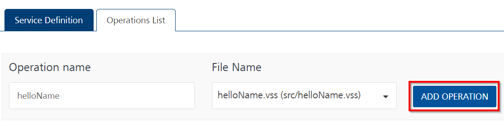
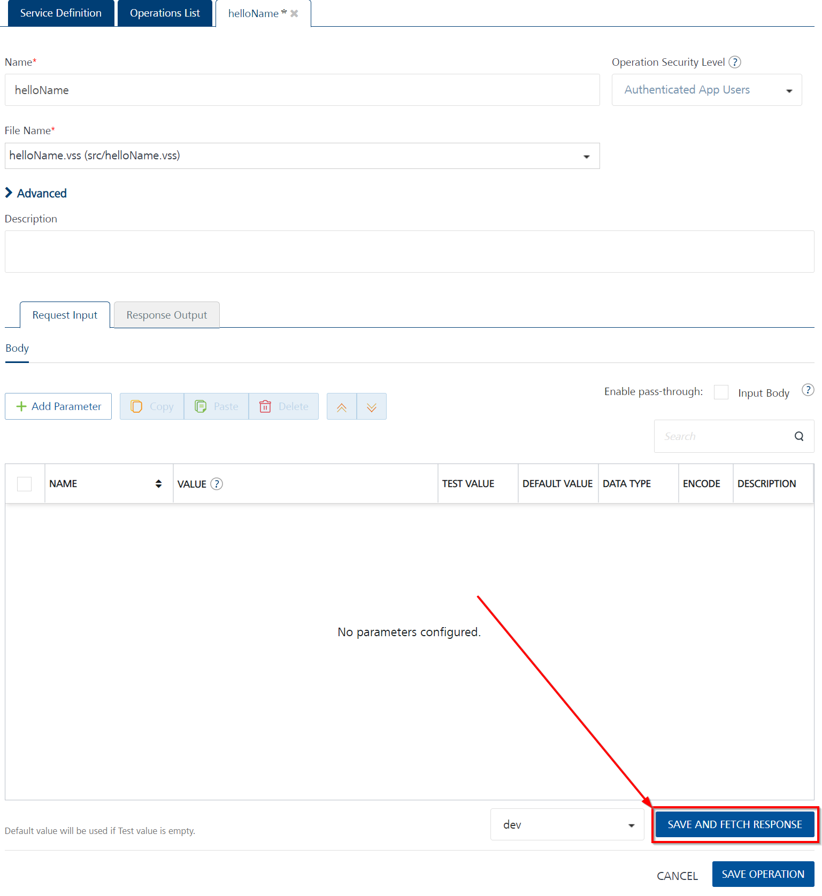

# Foundry Lab 02 - Hello Name Integration Service

## Duration 15 Min

## What you will learn

You'll learn how to create an integration with an input parameter, validate the input parameter and error or return a JSON object including a **message** element that says "Hello" to the username sent.

## Prerequisites

- Lab 01 completed

## Steps

### helloName.vss

1. For completeness, in `atlas.json`, add a second element to mainScripts called "helloName.vss".
1. Create a file "helloName.vss" in the src directory.
1. Type "foundry" and accept the Foundry Boilerplate snippet.
1. Between the two comment blocks, enter the following code:

    ``` voltscript
    If (VoltMxRequest.getInputParam("username") = "") Then
        Call VoltMxResult.setErrorMessage("Please enter username")
    Else
        Call VoltMxResult.result.insertValue("message", "Hello " & VoltMxRequest.getInputParam("username"))
    End If
    ```

1. Save the file.

### Package for Volt Foundry

1. From the **Command Palette**, run "VoltScript: Package for Foundry".
1. Enter the project directory, confirm atlas.json locations and continue with nothing entered for additional files to package.

!!! success
    A file is created in the root of the project called "foundry-lab.1.0.0.zip". The zip name comprises the project name and the project version from the atlas.json.

### Update Volt Foundry Integration Service

1. Log into Volt Foundry.
1. On the **Apps** page, select the app you created in Foundry Lab 01.
1. On **Configure Services** tab, click the **Integration** tab.
1. Click the **Service Definition** tab for the "foundry-lab-vs" integration service.
1. Click **Upload New** and select the zip file you just created. You will receive a warning that this will update the endpoint operations. Click **OK**.
1. Set the **Name** to "helloName".
1. Click **SAVE & ADD OPERATION**.
1. Select "helloName.vss" as the file.
1. Click **ADD OPERATION**.

    

1. Scroll down to the bottom of the operation and click **SAVE AND FETCH RESPONSE**.

    [](../../assets/images/tutorials/foundry-lab02-02.png){: target="_blank" rel="noopener noreferrer"}

    !!! success
        The Output Result shows the following JSON object:

        ```json
        {
            "ErrorCode": "7060",
            "ErrorMessage": "Error occurred while processing the VoltScript. Cause Please enter username."
        }
        ```

1. On the **Request Input** tab of the operation, click **+ Add Parameter**.
1. Set the **NAME** to "username".
1. Set the **TEST VALUE** to "John Doe".
1. Scroll down to the bottom of the operation and click **SAVE AND FETCH RESPONSE**.

    [](../../assets/images/tutorials/foundry-lab02-03.png){: target="_blank" rel="noopener noreferrer"}

    !!! success
        The output result shows the following JSON object:

        ```json
        {
            "opstatus": 0,
            "message": "Hello John Doe",
            "httpStatusCode": 0
        }
        ```