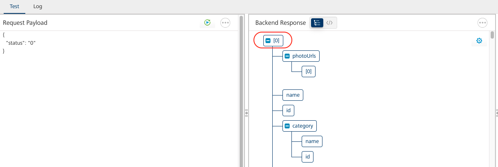
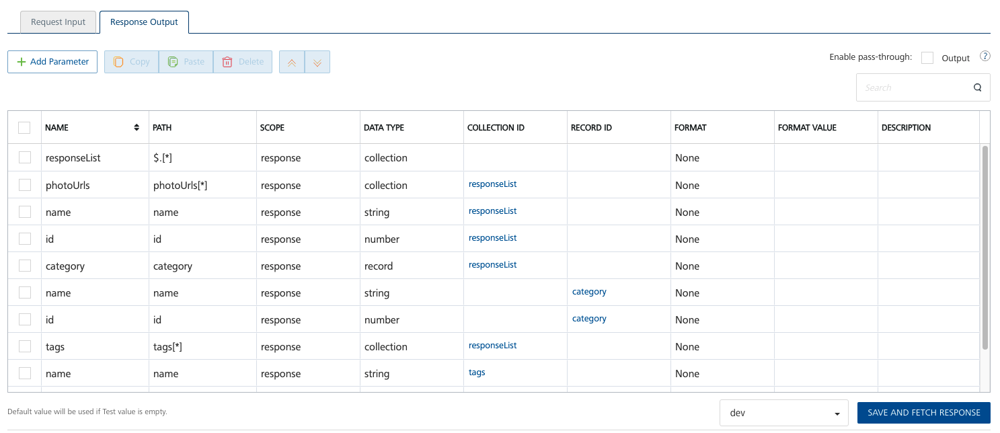
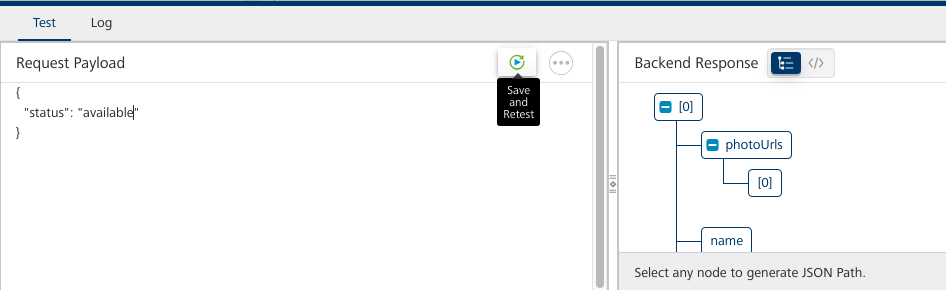

# Foundry Lab 04 - VoltScript pre/postprocessors

## Duration 15 Min

## What you will learn

You'll learn how to create a JSON integration service, manipulate / validate input parameters in a VoltScript preprocessor and manipulate the output in VoltScript postprocessor.

## Prerequisites

- Lab 03 completed

## Steps

### Create Integration Service

1. Log into Volt Foundry.
1. On the **Apps** page, click **ADD NEW**
1. On **Configure Services** tab, click the **Integration** tab and then click **CONFIGURE NEW**.

    

1. Set the **Name** to "petstore".
1. Select "JSON" under **Service Type**.
1. Set the **Base URL** to "https://petstore.swagger.io/v2/".
1. Click **SAVE & ADD OPERATION**.
1. On the **NewOperation** tab, set the **Name** to "getPets".
1. Set the **Target URL** to "pet/findByStatus?status=$status".

    !!!note
        The `$status` means it will pick up an input parameter called "status".

1. Scroll down to the **Request Input** tab and click **+ Add Parameter**.
1. Set the **NAME** to "status".
1. Set the **TEST VALUE** to "available".
1. Scroll down to the bottom of the operation and click **SAVE AND FETCH RESPONSE**.

    !!! success
        A JSON payload of available pets is returned.

### Create preprocessor

1. On the **NewOperation** tab, expand the **Advanced** section.
1. On the **Custom Code Invocation** tab, select the **VoltScript** radio button under **Preprocessor**.
1. Select the **Validate Input Parameter** code snippet. This shows how to retrieve and check input parameters, using `return false` to abort execution.
1. Replace the code with the following VoltScript code:

    ``` voltscript
    Dim status as String
    status = VoltMxRequest.getInputParam("status")

    Select Case status

    Case "0":
        Call VoltMxResult.addInputParam("status","available")
    Case "1":
        Call VoltMxResult.addInputParam("status","pending")
    Case "2":
        Call VoltMxResult.addInputParam("status","sold")
    Case Else
        Call VoltMxResult.setErrorMessage("Unexpected status passed - " & status)
        return false
    End Select
    ```

    This manipulates the incoming parameter, switching from a number to a corresponding string.

1. Change the test value to `0`.
1. Scroll down to the bottom of the operation and click **SAVE AND FETCH RESPONSE**.

    !!! note
        The output result just includes **opstatus** and **httpStatusCode**. This is because nothing has been mapped from the **backend response** (the response from the JSON service) to the **output result** (the Foundry response).

1. On the **Backend Response**, click [0] to create a response.

    

    If you scroll down the operation and look at the **Response Output** tab, you'll see a `responseList` collection has been added to the output, along with all the JSON elements.

    

1. On the **Test** tab, change the status passed in the JSON object to "available".

    

1. Click **Save and Retest**.

    !!! success
        You've ran validation and manipulated an input parameter. Although this particular use case is unlikely, two of the most common use cases for a preprocessor will be validating an input parameter and setting an input parameter, which we've done here.

### Create postprocessor

1. On the **NewOperation** tab, expand the **Advanced** section.
1. On **Custom Code Invocation** tab, select the "VoltScript" radio button under **Postprocessor**.
1. Paste the following VoltScript code:

    ``` voltscript
    Dim child as JsonObject
    Dim responseList as JsonObject
    Dim newResponseList as New JsonObject()
    Set responseList = VoltMXResult.result.getChild("responseList")
    ForAll jsonObj in responseList.getChildren()
        Set child = jsonObj
        If (child.isChild("name")) Then
            Call child.insertValue("name", StrConv(child.getChild("name").scalarValue, 3))
            Call newResponseList.appendToJsonArray(child)
        End If
    End ForAll
    Call VoltMxResult.result.insertValue("responseList", newResponseList)
    ```

    This gets the `responseList` element in the `VoltMxResult` result. "responseList" was the name the response was mapped to on the **Response Output** tab. We then iterate the children and, for those with a "name" element, proper case the name and add to a new JsonObject array. We then replace the `responseList` element with the new JSON array.

1. Scroll down to the bottom of the operation and click **SAVE AND FETCH RESPONSE**.

    !!! success
        You've manipulated the response from a third-party integration service. This is one of the most common use cases for a postprocessor.