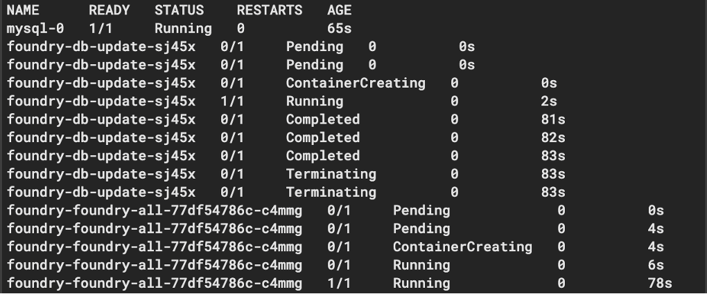

# Install Volt Foundry

The procedures will guide you in the installation of Volt Foundry.

## 1. Download Volt Foundry charts

1. Run the following command to make sure that the chart information for the repositories is up-to-date.

    ``` bash
    helm repo update
    ```

1. Run the following commands to download the Volt Foundry chart, unpack the files, change directory, and add execute permission:

    ``` bash
    helm pull hclcr/foundry-all
    tar -xzf foundry-all-0.6.0.tgz
    cd foundry-all
    chmod +x init-guids.sh
    ```

    !!! note
        The chart name has a version string in the filename. The `helm pull` command will pull down the latest version of the chart. Ensure your tar command uses the correct matching filename, such as `foundry-all-0.6.0.tgz`.

1. Volt Foundry uses several Global Unique IDs to distinguish different installations of Volt Foundry. Invoke the init-guids script to generate the IDs using the following command:

    ``` bash
    ./init-guids.sh --new
    ```

1. Edit the `values.yaml` file to update the `imageCredentials` by replacing `your-email` and   `your-authentication-token` with your [email and authentication token](obtainauthenticationtoken.md) used with the HCL Container Repository.

    ``` { .yaml .no-copy }
    imageCredentials:
      username: your-email
      password: your-authentication-token
    ```

    !!! note
        Use the **CLI secret** value you saved from [obtaining authentication token from HCL Container Repository](obtainauthenticationtoken.md) as your authentication token or password.

1. Locate the following line in the file and add your Volt Foundry server domain name setting:

    ``` { .yaml .no-copy }
    serverDomainName:
    ```

    !!! example
        The example name used is `foundry.mymxgo.com`.
        ``` .yaml
        ### Application Server Details ###

        # Domain name for Volt Foundry (String)
        # This value should not be IP address or 'localhost'
        # This value should be hostname of the LoadBalancer
        serverDomainName: "foundry.mymxgo.com"
        ``` 

    --8<-- "resolvablehostnames.md"

1. Locate the following lines in the file and add your Volt Foundry database details. Use the example values as they match the values used for the MySQL install in the [Install MySQL for Volt Foundry](installmysqlfoundry.md).

    ``` { .yaml .no-copy }
    ### Database details ###

    # Database type which you want to use for Volt Foundry (String)
    # Possible values:
    #   "mysql" for MySQL DB server
    #   "sqlserver" for Azure MSSQL or SQLServer
    #   "oracle" for Oracle DB server
    dbType: "mysql"

    # Database server hostname (String)
    dbHost: "mysql"

    # Database server port number (Number). This can be empty for cloud managed service.
    dbPort: 3306

    # Database User and password - you may set a single general userid/password here,
    # or you may set specific userid/password combinations below.  If set, the
    # specific values override the general dbUser/dbPass.

    # Database server user (String)
    dbUser: "root"

    # Database server password (String) enclosed in quotes
    dbPass: "Password123!"
    ```

    See [Installing_Containers_With_Helm.html](https://opensource.hcltechsw.com/volt-mx-docs/95/docs/documentation/Foundry/voltmxfoundry_containers_helm/Content/Installing_Containers_With_Helm.html)
    for more details.

1. **(Optional)** If you would like to install the `Engagement` component, you can do so by locating the following line in the file and setting the value to `true`.

    ``` { .yaml .no-copy }
    engagementEnabled: true
    ```

1. Save the file and exit.

## 2. Install Volt Foundry

1. Run the following Helm install command to deploy Volt Foundry:

    ``` bash
    helm install foundry . -f values.yaml
    ```

    !!! warning "Important"
        The deployment process takes several minutes (more than 5 minutes based on tests). Kindly wait for the process to complete. Once done, you receive a notification that the application has been deployed successfully, including release, build, database, and application information. Otherwise, you will receive an error notification that the deployment is unsuccessful.

    !!! failure "Installation Failure"

        

        If an installation failure occurs, perform the following steps:

        1. Issue the command `helm uninstall foundry`. This gives you a clean slate for installation. 
        1. Verify all configuration information is correct. 
        1. Double check that you do not have another running Foundry (such as a prior development version) container.
        1. Ensure your Rancher Desktop is up to date. 
        1. Ensure your Kubernetes version used by Rancher Desktop is up to date. 
        1. Ensure you have enough resources (memory / processors) assigned to Rancher Desktop. 
        1. Restart your Rancher desktop and try the installation again.

1. Run the following command to verify when the Volt Foundry install is ready:

    ``` bash
    kubectl get pods -o wide -w
    ```

    The output should be similar to the following and will update over time:

    

1. Monitor all the foundry pods except for the foundry-db-update pod as it has already been completed. Once the other foundry pods have a 1/1 state in the READY column, press `Ctrl-c` to stop the kubectl command.

**Volt Foundry is now available at [http://foundry.mymxgo.com/mfconsole/](http://foundry.mymxgo.com/mfconsole/)**.

!!! note
    - If you defined a different Volt Foundry hostname, the Volt Foundry URL would be the defined Volt Foundry hostname concatenated with `/mfconsole/`.
    - If you want to access this deployment from a remote machine, you most likely need to update the `/etc/hosts` file on the remote machine as well. Specify the **IPv4 address** for the Windows system where Volt Foundry is installed. If using a wired connection, use the **IPv4 Address** under **Ethernet adapter Ethernet 3**. If using a wireless connection, use the **IPv4 Address** under **Wireless LAN adapter Wi-Fi**.

    - To create an account, see [Create a Volt Foundry administrator account](https://opensource.hcltechsw.com/voltmxgo-documentation/howto/foundryadminaccount.html).
    