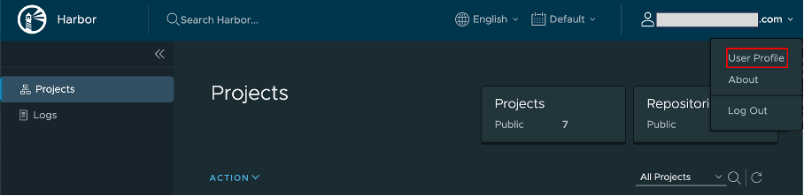
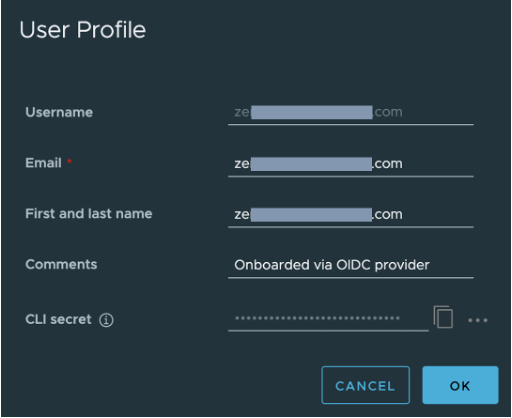

# Obtain authentication token from HCL Container Repository

## About this task

The binary images and Helm charts for Volt MX Go server components are pulled from the HCL Container Repository. This requires you to get your authentication token from the HCL Container Repository. This task guides you on how to obtain your authentication token.

## Procedure

1. Go to the [HCL Container Repository](https://hclcr.io "Link opens a new tab"){: target="_blank" rel="noopener noreferrer"}.

2. On the login page, click **LOGIN VIA OIDC Provider**, and then login using your corporate email address.
3. On the **Projects** page, click your username and select **User Profile**.

    

4. On the **User Profile** dialog, copy the value of the **CLI secret** by clicking the copy icon.

    

5. Save the **CLI secret** value as it's required in the next steps.

    !!!note
        You will use the **CLI secret** value as your authentication token or password when using Docker or Helm CLI to access HCL Container Repository.

6. Take note of exactly how your email address is written in the **User Profile** dialog as authentication is case sensitive on the user email.

## Next step

[Complete preparatory procedure for installation of Volt Foundry](prereqs/index.md).