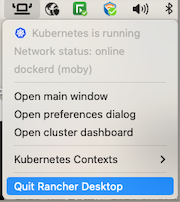

# Mac with Rancher Desktop

## Operating System

- MacOS Ventura (version 13) or greater

## Hardware

| Spec | Minimum |
| ---- | ------- |
| CPU | 4 core (Intel) |
| RAM | 16 GB |

## Additional requirements

Rancher Desktop requires the following on MacOS:

- Apple Silicon (M1) or Intel CPU with VT-x (virtualization capabilities).
- Persistent internet connection.

If you do not already have Rancher Desktop installed, follow the installation instructions for MacOS [here](https://docs.rancherdesktop.io/getting-started/installation/#macos).

!!!note
    It is recommended to use Rancher Desktop version 1.15.1.

Most of the default settings will be adequate. However, the default virtual machine size of 4GB is insufficient for Volt Foundry.

1. Cick on the Rancher Desktop icon in the system tray.
1. Click **Open preferences dialog**.
1. On the **Virtual Machines** tab change "Memory (GB)" to **8**.

!!! note
    If you have the Rancher Desktop main window open, you can access the preferences dialog by clicking on the "cog" icon.

### Additional information

When run for the first time or when changing versions, Kubernetes container images are downloaded. It may take a little time to load on the first run for a new Kubernetes version.

After Rancher Desktop installation, users have access to these supporting utilities:

- Helm
- kubectl
- nerdctl
- Moby
- Docker Compose

--8<-- "authtoken.md"

## Update hosts file

1. Edit your `/etc/hosts` file to associate this IPV4 address with the *.mymxgo.com domian entries

    For example:

    ```
    # Foundry in Rancher
    127.0.0.1 drapi.mymxgo.com drapi-management.mymxgo.com foundry.mymxgo.com
    ```

1. Save the file and exit the editor.
1. Run the following command to force the restart of the coredns pod:

    ``` bash
    kubectl delete pod -n kube-system -l k8s-app=kube-dns
    ```

1. Restart Rancher Desktop:

    Click on the Rancher Desktop icon in your workspace and choose "Quit Rancher Desktop"
    
    

    Once it has completely shut down (it may take a few minutes) you can start it again from your **Applications Launcher**.

--8<-- "resetkubecontext.md"

## Create a temp directory for the charts

Run the following commands to create a temp directory for the charts and make it the current directory:

``` bash
mkdir ~/mxgo
cd ~/mxgo
```

## Next step

If you are using a pre-existing implementation of Domino REST API, proceed to [Install MySQL for Volt Foundry](../installmysqlfoundry.md). Otherwise proceed to [Install Domino REST API](../downloadhelmchart.md).