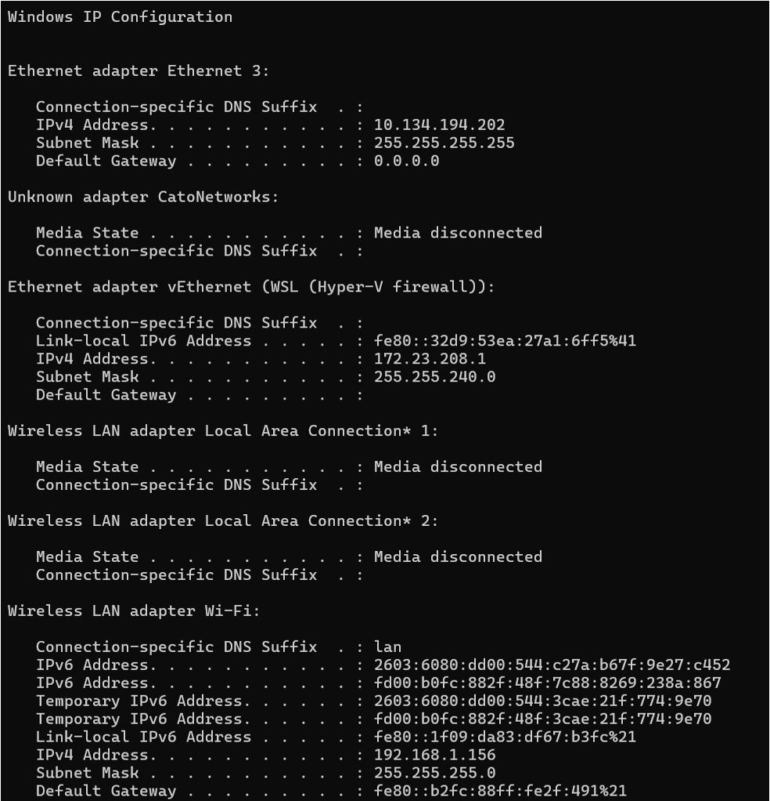

# Windows with Rancher Desktop

## Operating System

- Windows 10 build 1909 or higher
- Windows 11

## Hardware

| Spec | Minimum |
| ---- | ------- |
| CPU | 4 cores |
| RAM | 32 GB |

## Additional requirements

Rancher Desktop requires the following on Windows:

- Running on a machine with virtualization capabilities.
- Persistent internet connection.
- Windows Subsystem for Linux on Windows. This will automatically be installed as part of the Rancher Desktop setup. Manually downloading a distribution isn't necessary.

!!!note
    You can use Rancher Desktop as a Non-Admin user on a Windows machine. However, an Admin's intervention is required during the installation process for the following components:

    - WSL2 - Rancher Desktop requires Windows Subsystem for Linux (WSL2) on Windows. You need Admin privileges to install WSL2, which is an essential component of Rancher Desktop.
    - Rancher Desktop Privileged Service - You need Admin privileges to install the Rancher Desktop privileged service, which is required to expose applications/services, running inside containers, on all interfaces on the host machine. However, you can skip the installation of the Rancher Desktop Privileged Service with the limitation that you will not be able to expose applications/services on any interface except 127.0.0.1.

## Install or Update WSL2

Before installing Rancher Desktop, make sure you have an up-to-date installation of WSL2. If you are already using WSL2, [update WSL2](#update-wsl2). Otherwise, [install WSL2](#install-wsl2).

### Update WSL2

If you are already using WSL2, open PowerShell or Windows Command Prompt in administrator mode by right-clicking and selecting **Run as administrator**. Run the following command to make sure WSL2 is up-to-date:

```
wsl --update
```

Follow any instructions given by the WSL update process. Afterward, from a Windows command prompt or PowerShell window, run the following command to make sure Ubuntu is the default distribution:

=== "For Ubuntu-22.04"

    ```
    wsl --set-default Ubuntu-22.04
    ```

=== "For Ubuntu-24.04"

    ```
    wsl --set-default Ubuntu-24.04
    ```

Proceed to [install Rancher Desktop](#install-rancher-desktop).

### Install WSL2

Open PowerShell or Windows Command Prompt in administrator mode by right-clicking and selecting **Run as administrator**. Run the following command to install WSL2 using either Ubuntu-22.04 or Ubuntu-24.04 as the Linux distribution. 

=== "For Ubuntu-22.04"

    ```
    wsl --install -d Ubuntu-22.04
    ```

=== "For Ubuntu-24.04"

    ```
    wsl --install -d Ubuntu-24.04
    ```

!!!warning "Important"
    Restart your machine after this initial installation to complete the setup. Once the restart has completed, return to this documentation and complete the steps that follow.

Enter `Ubuntu` on the Windows search box and open the **Ubuntu on Windows App**. You should be prompted to create a username and password.

!!!tip
    Use the first letter of your first name and your full last name as your username such as _jdoe_. Use a password that's easy for you to remember.

If you aren't prompted to create a username and password, run the following command to do so, adding your username such as _sudo adduser jdoe_:

```
sudo adduser
```

It's not required to enter more information, simply hit the **Enter** key and respond `Y` when prompted **Is the information correct?**.

!!! warning "Important"
    Make certain that **Ubuntu-22.04** or **Ubuntu-24.04** is your default WSL distribution. From a Windows command prompt or PowerShell window, run the following command:

    === "For Ubuntu-22.04"

        ```
        wsl --set-default Ubuntu-22.04
        ```

    === "For Ubuntu-24.04"

        ```
        wsl --set-default Ubuntu-24.04
        ```

You are now ready to install Rancher Desktop.

### Install Rancher Desktop

1. Download the latest version of the Windows installer from the [Rancher Desktop Releases](https://github.com/rancher-sandbox/rancher-desktop/releases) page.

    !!!note
        It is recommended to use Rancher Desktop version 1.15.1.

1. Navigate to the directory where you downloaded the installer to and run the installer. This is usually the **Downloads** folder.
1. Review the License Agreement, and then click **I Agree** to proceed with the installation.
1. If prompted, choose between installing for everyone on the machine or installing just for the current user. Installing for everyone is preferred to installing the Rancher Desktop Privileged Service.
1. Follow the prompts to confirm installation.
1. When the installation completes, click **Finish** to close the installation wizard.
1. Make sure that **Ubuntu** is selected under **WSL** in Rancher Desktop:

    1. Open Rancher Desktop, and then click **Preferences**.

        

    1. On the **Rancher Desktop - Preferences** dialog, click **WSL** and then click the **Integrations** tab.
    1. Select the **Ubuntu** checkbox.

        

    1. On the **Virtual Machines** tab change "Memory (GB)" to **8**.
    1. Click **Apply**.

!!! warning "Important"
    Use an Ubuntu terminal session to run all the commands in future sections. To access the Ubuntu terminal, enter "Ubuntu" in the Windows search box and select the Ubuntu for Windows App. An Ubuntu terminal session opens with your home directory set as your current directory.

### Additional information

When run for the first time or when changing versions, Kubernetes container images are downloaded. It may take a little time to load on the first run for a new Kubernetes version.

After Rancher Desktop installation, users have access to these supporting utilities:

- Helm
- kubectl
- nerdctl
- Moby
- Docker Compose

!!! warning "Important"
    You **must** use an Ubuntu terminal session to run all the commands in this section and the other subsequent sections. To access the Ubuntu terminal, enter "Ubuntu" in the Windows search box and select the Ubuntu for Windows App. An Ubuntu terminal session opens with your home directory set as your current directory.

--8<-- "authtoken.md"

## Update hosts file

1. From a Command Prompt on either Windows 10 or Windows 11, obtain the IPv4 Address for the Ethernet adapter vEthernet (WSL) via the `ipconfig` command.

    

    !!! warning "Important"
        - Select the correct **IPv4 Address** under **Ethernet adapter vEthernet (WSL (Hyper-V firewall))**, which by default starts with **172**. Placing the correct IPv4 address in the Windows host file ensures deployment is reachable from within WSL2 and Windows.
        - If you want to access this deployment from a remote machine, you most likely need to update the `/etc/hosts` file on the remote machine as well. Specify the **IPv4 address** for the Windows system where Volt Foundry is installed. If using a wired connection, use the **IPv4 Address** under **Ethernet adapter Ethernet 3**. If using a wireless connection, use the **IPv4 Address** under **Wireless LAN adapter Wi-Fi**. 

1. Add the hostnames that you have chosen to use in your `C:\Windows\System32\drivers\etc\hosts` file together with your IPv4 ADDRESS and dns domain name.

    For example:

    ```
    172.23.208.1 drapi.mymxgo.com drapi-management.mymxgo.com foundry.mymxgo.com
    ```

1. Save the file and exit the editor.
1. Run the following command to force the restart of the coredns pod:

    ``` bash
    kubectl delete pod -n kube-system -l k8s-app=kube-dns
    ```

1. Restart Rancher Desktop:

    1. Select **File** &rarr; **Exit** to close the current session.
    2. Open a new session by opening Rancher Desktop via the desktop icon.

--8<-- "resetkubecontext.md"

## Create a temp directory for the charts

Run the following commands to create a temp directory for the charts and make it the current directory:

``` bash
mkdir ~/mxgo
cd ~/mxgo
```

## Next step

If you are using a pre-existing implementation of Domino REST API, proceed to [Install MySQL for Volt Foundry](../installmysqlfoundry.md). Otherwise proceed to [Install Domino REST API](../downloadhelmchart.md).