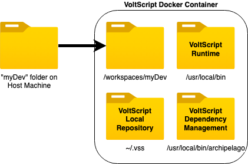
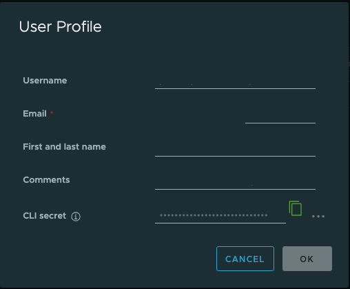
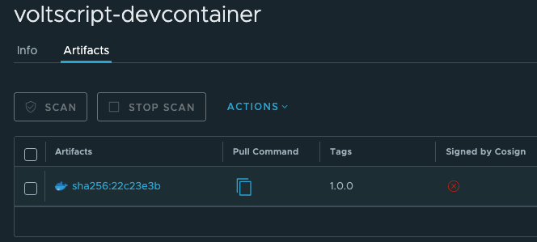

# VoltScript using a Docker Container

Docker Development is done using a **Visual Studio Code Dev Container**. This is a standard Visual Studio Code approach that mounts your folder inside a container. For more details see the [Visual Studio Code documentation](https://code.visualstudio.com/docs/devcontainers/containers){: target="_blank" rel="noopener noreferrer"}.

Visual Studio Code is installed locally. The folder that opens in Visual Studio Code's **Explorer** view is physically on your host machine, but it has been *injected* into the Linux Docker container inside the "/workspaces" directory. Although Visual Studio Code has access to all extensions installed locally, effectively it believes it's running within the container: the terminal sees only the container, **File** &rarr; **Open** commands look for files in the container.



!!! note
    If the folder you're opening is within a git repository, Visual Studio Code seems to inject the whole git repository into the container and the same container seems to be shared across all folders opened in dev containers.

!!! warning
    atlas-settings still needs to be in ~/.vss directory in the container. It will persist between uses of the container. But using the "Dev Containers: Rebuild Container without Cache" will delete the container, and thus the contents of the ~/.vss directory. You may wish to keep a copy locally, or investigate mounting a local .vss directory into the container.

## Prerequisites

The pre-requisites for using Dev Containers are:

- Installing Docker Desktop (or Rancher Desktop).
- Installing Visual Studio Code.
- Installing the [Dev Containers extension](https://marketplace.visualstudio.com/items?itemName=ms-vscode-remote.remote-containers){: target="_blank" rel="noopener noreferrer"} in Visual Studio code.

This is covered in the [Getting Started documentation](https://code.visualstudio.com/docs/devcontainers/containers#_getting-started){: target="_blank" rel="noopener noreferrer"}, so you will need to go through the Installation section.

The prerequisites only need to be installed once per laptop.

## Docker Image

You will need to load the docker image for VoltScript downloaded from [Harbor](https://hclcr.io/){: target="_blank" rel="noopener noreferrer”}. This includes the VoltScript executable, the VoltScript extensions for Visual Studio Code and VoltScript_Archipelago build manager code.

1. Navigate to [Harbor](https://hclcr.io/){: target="_blank" rel="noopener noreferrer”} and login.
1. On the **Projects** page, enter "voltmxgo-ea" in the search field, and then click "voltscript-devcontainer" on the search result.
1. On the **voltscript-devcontainer** project page, click your username and select **User Profile**.
1. Take note of exactly how your email address is shown.
1. Copy the **CLI secret** to your clipboard.

    

    !!! note
        You will use the CLI secret as your authentication token when using Docker CLI to access the HCL Container Repository.

1. Open up a Terminal window.
1. Type `docker login https://hclcr.io` and press enter.
1. Enter the email address from your user profile as the username.
1. Paste the CLI secret as the password.
1. Once login is successful, enter the command `docker pull hclcr.io/voltmxgo-ea/voltscript-devcontainer:1.0.3` and press enter.

    !!! warning
        Do not click the copy icon in the "Pull Command" column on the **voltscript-devcontainer** project page. This uses the SHA hash instead, so the Docker image will come down untagged.

        

1. The image should now be available. You can confirm by issuing the command `docker images`, where you should find an image named "hclcr.io/voltmxgo-ea/voltscript-devcontainer" with a tag 1.0.3.

## Creating the Dev Container

To instruct VS Code to open a folder in a container, you need to add a [devcontainer.json](https://code.visualstudio.com/docs/devcontainers/containers#_create-a-devcontainerjson-file){: target="_blank" rel="noopener noreferrer"} file in the folder. This can be done either:

- In the root of your VS Code workspace, as **.devcontainer.json**.
- In a folder within your VS Code workspace, as **.devcontainer/devcontainer.json**.

!!!note
    Remember to add the path to your .gitignore file, to avoid polluting other developers' environments.

At the minimum, the JSON file must have the following content:

```json
{
    "image": "hclcr.io/voltmxgo-ea/voltscript-devcontainer:1.0.3",
    // Configure tool-specific properties.
    "customizations": {
        // Configure properties specific to VS Code.
        "vscode": {
            "extensions": [
                "/tmp/vscode-voltscript.vsix",
                "/tmp/vscode-voltscript-archipelago.vsix"
            ]
        }
    }
}
```

This uses the image loaded and adds into VS Code the Linux VSIX, which is part of the image. Additional extensions can be added to the container, as required.

Once the `devcontainer.json` is created and saved, you can bring up the **Command Palette** (**View** &rarr; **Command Palette** or the relevant platform keyboard shortcut) and navigate to "Reopen in Container" command. When you open VS Code and choose **File** &rarr; **Open Recent**, you will subsequently see entries appended with "[Dev Container]", which will automatically open the folder in the devcontainer.

!!! note
    Any files added outside the workspace folder will be cached between sessions. So if you close VS Code and come back later, the atlas-settings.json file you create will still be available. However, if you use the command "Dev Containers: Rebuild Container Without Cache", it will delete the container and create a new one.

!!! note
    A folder can only be opened in one devcontainer at a time. If you want to launch content in another container, that can be done with a standard `docker run --rm -it...` command from a terminal.

!!! info
    The container will run as a non-root user, with limited access to the Linux filesystem. If you need to connect as root, this can be done with normal Docker commands for connecting to an existing running container: `docker exec -it --user root CONTAINER_NAME /bin/bash`. To find the container name, click on the "Remote Explorer" tab in the left-hand gutter. The container name will be displayed against the relevant dev container and in the attributes area of the middle panel.

!!! warning
    If you open VS Code from a folder in Finder, linkages to Docker may not be created correctly. For consistent results, launch VS Code or a new window of VS Code, and open the folder from the File menu.

## Advanced Dev Container configuration

With the minimum configuration, each dev container will use its own atlas-settings.json and a .vss directory in the home directory of the dev container. There will be no custom environment variables available and no additional extensions installed locally. And if you rebuild the container because an updated image is made available, you'll lose the atlas-settings.json and any VSEs pulled down into the .vss directory by dependency management.

However, there are a number of configuration options available for the VS Code devcontainer.json.

### Shared .vss directory

For first use, you'll need to create an atlas-settings.json in ~/.vss, as you do when working locally. To avoid this, you can mount a local .vss directory into the container. This is done with the `mounts` property. This can take with a string of key-value pairs or a JSON object.

First, you'll need a .vss directory to mount in. Best practice, as with developing directly on your host machine, is to create it in your user directory, so ~/.vss. You can create an atlas-settings.json in there, or wait until you're in the dev container. (Hint: you'll get content assist and snippets in the dev container, because you've got the VoltScript VS Code extensions available.)

Add one of the following JSON snippets to your devcontainer.json.

``` json title="Using a string"
"mounts": [
    "source=${localEnv:HOME}/.vss,target=/home/vs-user/.vss,type=bind"
]
```

``` json title="Using an object"
"mounts": [
    {
        "source": "${localEnv:HOME}/.vss",
        "target": "/home/vs-user/.vss",
        "type": "bind"
    }
]
```

### Passing environment variables explicitly

You can pass environment variables into the container by using the `containerEnv` property. To pass in a username for your atlas-settings.json, use the following JSON:

``` json
"containerEnv": {
    "USERNAME": "YOUR_NAME"
}
```

You can check if it's been picked up by launching the dev container, opening a terminal and issuing the command `echo $USERNAME`. It should return the value from the dev container.

### Passing an environment file

Of course it's not preferable to include passwords in your devcontainer.json, even though it's typically excluded from source control. With the `runArgs` property, you can use standard Docker commands to pass in an environment file instead. The file uses key-value pairs, as with any Docker env file. a .env file with this syntax will pass the username as above.

``` sh
USERNAME=YOUR_NAME
```

!!! tip
    Check env file syntax if you need to include non-basic content like values including spaces.

You'll probably want to store the file in your user directory and give it a filename that's clear, e.g. ".devcontainerEnv.env". To use this in your devcontainer.json, you will need to add the following JSON:

``` json
"runArgs": [
    "--env-file", "${localEnv:HOME}/.devcontainerEnv.env"
]
```

### Useful VS Code variables

You'll notice we've used some variables here. The [VS Code documentation](https://containers.dev/implementors/json_reference/#variables-in-devcontainerjson) has full details. But two useful ones are:

- `${localEnv:HOME}` to get the current user's HOME directory.
- `${localWorkspaceFolder}` to get the folder opened in VS Code.

## Working with the devcontainer

### VS Code Terminal

The VS Code terminal is now a Linux shell inside the container. You will usually find the folder from your host machine at "workspaces/FOLDER_NAME".

!!! note
    This seems to differ if the folder is part of a git repository.

### Dependency Management

Dependency management use a settings file in the devcontainer in the usual location, at `~/.vss/atlas-settings.json`. It's advisable to store a copy on your filesystem when opening additional containers or upgrading to a newer image.

### Updating to a New Image

If a new Docker image is released, you will need to pull the new image. You will also need to update the devcontainer.json in any project. After saving the modified devcontainer.json, you will be prompted to rebuild the container (or use "Dev Containers: Rebuild Container Without Cache"), to create a new container based on the updated image. Other options will just open the cached container based on the original image.

!!! warning
    Make sure to backup any files modified in the container, such as in `~/.vss directory`.

## Adding languages to containers

No additional language packs are installed in the docker image. If you wish to use the [locale parameters in ZuluVSE](../../howto/extensions/zulu.md#the-locale-parameter), you will need to add language packs. However, the container runs under a user who doesn't have access to change files outside specific locations. So you will need to connect to the container as the root user.

1. Open the relevant project in its dev container in Visual Studio Code. The docker container needs to be running to connect to it as a different user.
1. In Visual Studio Code, select the "Remote Explorer" icon in the left-hand gutter. In the top view, this will list dev containers created. In the middle view, this will list details of the current dev container. From here you can find the name of the docker container you wish to modify.
1. Open a terminal window, outside of Visual Studio Code.
1. Run the command `docker exec -it --user root CONTAINER_NAME /bin/bash`, using the relevant container name. This connects to the container an interactive session (`-it`) for bash (`/bin/bash`) as the root user (`--user root`).
1. The terminal will now be running within the container, as evidenced by the prefix looking like "root@8c451a0ea2fd:/#" - the 12-character hex string is the container ID. Run the command `apt-get install language-pack-XX`, replacing "XX" with the relevant language suffix. This is a standard Linux command, so the relevant language codes are well-documented on the internet.
1. After the language packs have completed, run `exit` to end the root session into the container.

You don't need to restart Visual Studio Code to pick up the language pack.