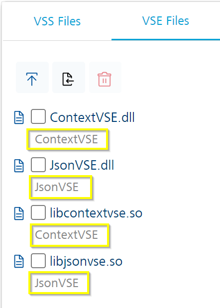

# VoltScript in Foundry Lab 01 - Hello World Integration Service

## Duration 20 Min

## What you will learn

You'll learn how to create a simple integration service to return a JSON object including a **message** element that says "Hello World" - all by writing the VoltScript code within Volt Foundry.

## Prerequisites

- Familiarity with creating an Integration Service in Volt Foundry.
- It would be good to have completed the VoltScript Foundry Tutorial [Lab 01](../foundry/lab-01.md).

## Steps

### Create Volt Foundry Integration Service

1. Log into Volt Foundry.
1. On the **Apps** page, click **ADD NEW**.

    

1. On **Configure Services** tab, click the **Integration** tab and then click **CONFIGURE NEW**.

    

1. Set the **Name** to "vs-in-foundry-lab".
1. Select "VoltScript" under **Service Type**.
1. Click **Create New**.

    [](../../assets/images/tutorials/vs-in-foundry/vsf-lab01-03.png){: target="_blank" rel="noopener noreferrer"}

1. Set the **Name** to "helloWorld".
1. Set the **Version** to "1.0".
1. OPTIONALLY enter a **Description** if desired.
1. On the *VSS Files* tab, click Add (**+**), then select **Add New File**.

    [](../../assets/images/tutorials/vs-in-foundry/vsf-lab01-04.png){: target="_blank" rel="noopener noreferrer"}

1. In the *Add New File* dialog, enter "helloWorld.vss", then click **Add**.

    

### Write the Integration Service Code

Once you've created the `helloWorld.vss` file in the editor, you'll notice that it's prepopulated with the necessary skeleton code you need for your Integration Service. This includes adding the USE statements for the necessary VoltScript Middleware VSS (`VoltMXObject`) and VoltScript Context VSE (`ContextVSE`) libraries, as well as a template for your Initialize subroutine.


HOWEVER, the `VoltMXObjects` VSS library and the `ContextVSE` and `JsonVSE` VSE extensions are NOT actually loaded yet - so let's add them to our code.

### Add Necessary Resources

!!!note
    You will need to have login credentials for the [Volt MX Marketplace](https://marketplace.demo-hclvoltmx.com/) and for [GitHub](https://github.com/) so that you can access the latest resources.

Let's add the VSEs we'll need first.

#### Import VSE Extensions

1. Click on the **VSE Files** tab in the editor, then click the **Import** button.

    

1. A login prompt will appear. Enter the credentials you created for the [Volt MX Marketplace](https://marketplace.demo-hclvoltmx.com/), then click **Login**.

    

1. After successfully logging in you're presented with a list of the VSEs available for download. Let's begin by selecting the **ContextVSE VoltScript Extension**, then click **IMPORT**.

    

1. Now we need to add the `JsonVSE` extension. Simply click the **Import** button again, select the **JsonVSE VoltScript Extension**, then click **IMPORT**.

    

1. Now you should have the `ContextVSE` and `JsonVSE` files loaded in the **VSE Files** tab. Notice that it automatically added both the Windows and Linux versions of the respective VSE extensions - this ensures that you will have access to these files no matter what OS the Volt Foundry server is using. These files are referenced in your code by their programmatic names - `ContextVSE` and `JsonVSE`.

    

Now that we have the VSE files in our Integration Service, we need to add the necessary VSS as well - `VoltMXObjects.vss`

#### Upload VSS Libraries

1. We need to upload the `VoltMXObjects.vss` library, so you'll need to log into [GitHub](https://github.com/) and locate the [Volt MX Middleware](https://github.com/HCL-TECH-SOFTWARE/voltscript-voltmx-middleware) repository.

1. Once there, locate the `Releases` area, and click on the **Latest** release.

    

1. We only need the `VoltMXObjects.vss` file. Click on the filename to download the file.

    

1. In the Integration Service editor, click on the **VSS Files** tab. Now select the **libs** directory, then click the **Upload** button.

    

1. Select the `VoltMXObjects.vss` file you downloaded earlier, and click **Open** to upload it into your Integration Service. Once it's uploaded, you should see the file in the **libs** directory in your editor.

    

1. We need one more VSS library for our Integration Service - [VoltScript Collections](https://github.com/HCL-TECH-SOFTWARE/voltscript-collections). Follow the same steps you used to download `VoltMXObjects.vss` and download `VoltScriptCollections.vss`, and upload it to the **libs** directory. Once you've done so you should see these files in your editor.

    

Now that we've successfully uploaded all of the needed resources, let's add some code to test; but before we continue, let's go ahead and save our Integration Service by click the **SAVE ZIP** button. You should then see a *Successfully updated.* status at the bottom of the page.

[](../../assets/images/tutorials/vs-in-foundry/vsf-lab01-15.png){: target="_blank" rel="noopener noreferrer"}

### Write Your First Integration Service Code

1. Click on the *helloWorld.vss* file in your Integration Service editor. You should see the boilerplate code added earlier.

    

1. Between the two comment blocks, enter the following code:

    ``` voltscript
    Call VoltMxResult.result.insertValue("message", "Hello World!")
    ```

    

1. Now that we have some code to test, click **SAVE & ADD OPERATION** at the bottom of the page.

    [](../../assets/images/tutorials/vs-in-foundry/vsf-lab01-18.png){: target="_blank" rel="noopener noreferrer"}

### Add An Integration Service Operation

When you click **SAVE & ADD OPERATION**, it takes you to the *Operations List* tab where you can add an *Operation* to test your code.

1. Set the name to "helloWorld".
1. Select "helloWorld.vss" as the file.
1. Click **ADD OPERATION**.

    

1. Scroll down to the bottom of the operation and click **SAVE AND FETCH RESPONSE** button.

    [](../../assets/images/tutorials/vs-in-foundry/vsf-lab01-20.png){: target="_blank" rel="noopener noreferrer"}

!!! warning
    You need to have an **environment** set up to test an operation. If you haven't yet configured one, save the operation, follow the steps in [Add an Environment](#add-an-environment), and then come back to the operation to test.

!!! success
    The Output Result returns:

    ```json
    {
        "opstatus": 0,
        "message": "Hello World!",
        "httpStatusCode": 0
    }
    ```

**Congratulations!** You've created your first VoltScript Integration Service.

----------------------------------------

### Add an Environment

1. On the left pane on the Volt Foundry Console, click **Environments**.
1. On the **Environments** page, click **Add New**. The **Add a New Environment** dialog opens.
1. In the **Environment Name** text box, enter an environment name.

    !!! note
        Your environment name can only contain letters, numbers, and hyphens (-). A hyphen can't appear at the beginning or at the end of a name. A number can't appear at the beginning of a name. A name should be a minimum of three characters and a maximum of 20 characters long.

1. On the **Server** tab, enter the URL of your Volt Foundry in the **URL** text box. The URL format is: `<http or https>://<server_host>:<server_port>`<br/>For example: http://mbaastest30.hcl.net:53504
1. Click **Test Connection** to verify that the entered URL is correct. If the test is successful, a check mark appears beside the **Server** tab.
1. Click **Save**.

    

The code for the lab is available on [GitHub](https://github.com/HCL-TECH-SOFTWARE/voltscript-samples/tree/main/samples/foundry).