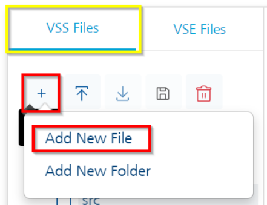
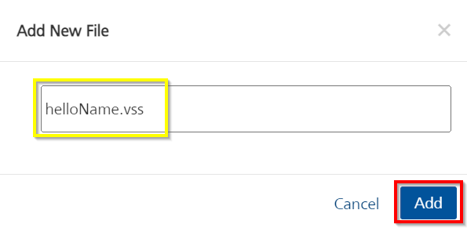
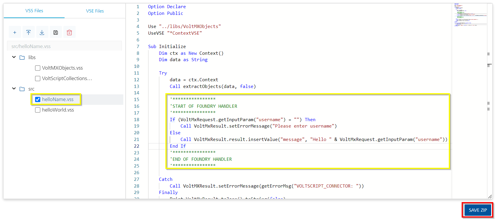
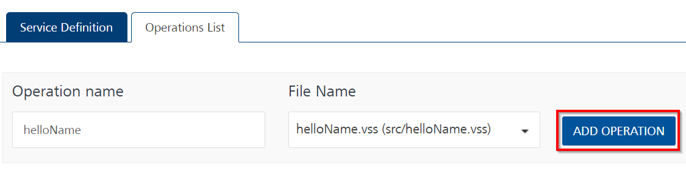
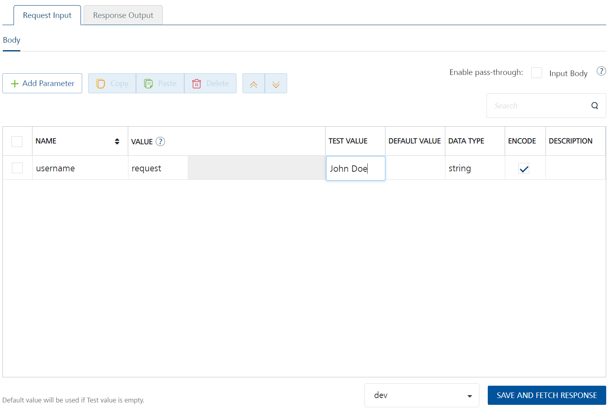

# VoltScript in Foundry Lab 02 - Hello Name Integration Service

## Duration 15 Min

## What you will learn

You'll learn how to create an Integration Service with an input parameter, validate the input parameter and error or return a JSON object including a **message** element that says "Hello" to the username sent.

## Prerequisites

- [VoltScript in Foundry - Lab 01](./lab-01.md) completed.

## Steps

We're going to build off of our work in [VoltScript in Foundry - Lab 01](./lab-01.md) to create a second VSS library using the Foundry VoltScript editor.

### Create helloName.vss

Since we've already added the VSS and VSE libraries we need when completing Lab 01 we can begin by creating our new library.

1. Log into your Volt Foundry server.
1. Open the App you created in Lab 01.
1. Click on the **Integration** tab.
1. Click on your Integration Service.
1. In the VoltScript Editor area, click on the *VSS Files* tab, click Add (**+**), then select **Add New File**.

    

1. In the *Add New File* dialog, enter "helloName.vss", then click **Add**.

    

1. in the editor, click on the new `helloName.vss` file. You should see the VoltScript boilerplate code.
1. Between the two comment blocks, enter the following code:

    ``` voltscript
    If (VoltMxRequest.getInputParam("username") = "") Then
        Call VoltMxResult.setErrorMessage("Please enter username")
    Else
        Call VoltMxResult.result.insertValue("message", "Hello " & VoltMxRequest.getInputParam("username"))
    End If
    ```

1. Click the **SAVE ZIP** button.

    [](../../assets/images/tutorials/vs-in-foundry/vsf-lab02-03.png){: target="_blank" rel="noopener noreferrer"}

1. Click on **SAVE & ADD OPERATION** at the bottom of the screen. When you click **SAVE & ADD OPERATION**, it takes you to the *Operations List* tab where you can add an *Operation* to test your code.

### Add An Integration Service Operation

1. Set the name to "helloName".
1. Select "helloName.vss" as the file.
1. Click **ADD OPERATION**.

    

1. Scroll down to the bottom of the operation and click **SAVE AND FETCH RESPONSE** button.

    !!! success
        The Output Result shows the following JSON object:

        ```json
        {
            "ErrorCode": "7060",
            "ErrorMessage": "Error occurred while processing the VoltScript. Cause Please enter username."
        }
        ```

1. On the **Request Input** tab of the operation, click **+ Add Parameter**.
1. Set the **NAME** to "username".
1. Set the **TEST VALUE** to "John Doe".
1. Scroll down to the bottom of the operation and click **SAVE AND FETCH RESPONSE**.

    [](../../assets/images/tutorials/vs-in-foundry/vsf-lab02-05.png){: target="_blank" rel="noopener noreferrer"}

    !!! success
        The output result shows the following JSON object:

        ```json
        {
            "opstatus": 0,
            "message": "Hello John Doe",
            "httpStatusCode": 0
        }
        ```

The code for the lab is available on [GitHub](https://github.com/HCL-TECH-SOFTWARE/voltscript-samples/tree/main/samples/foundry).