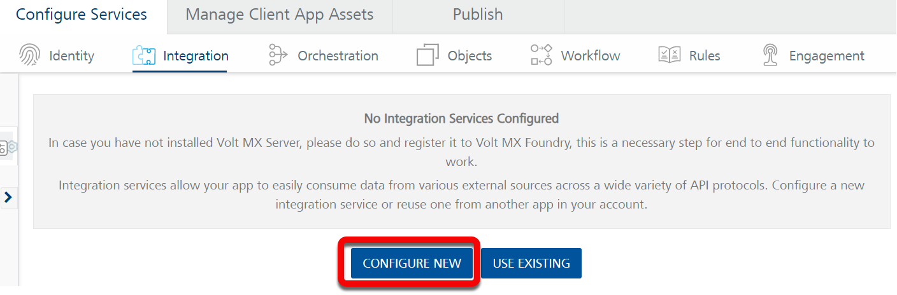
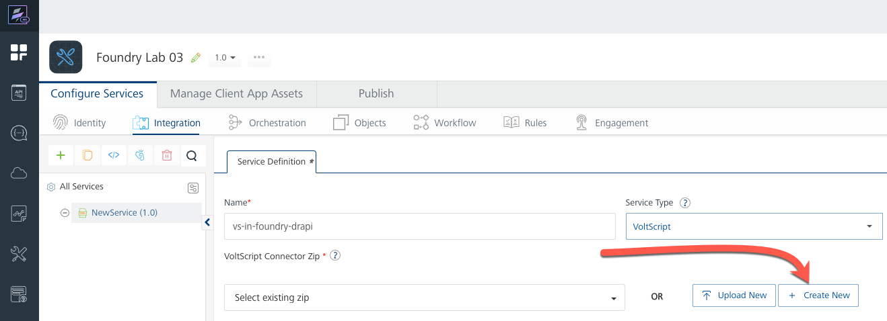
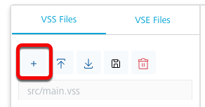
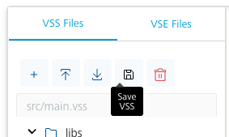
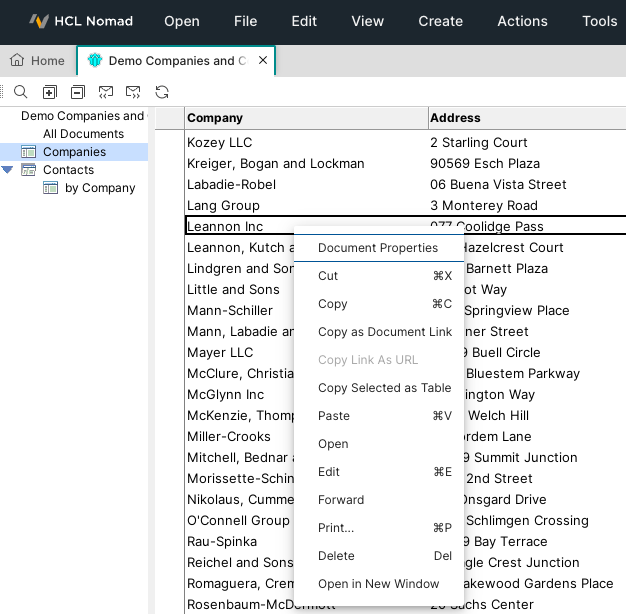
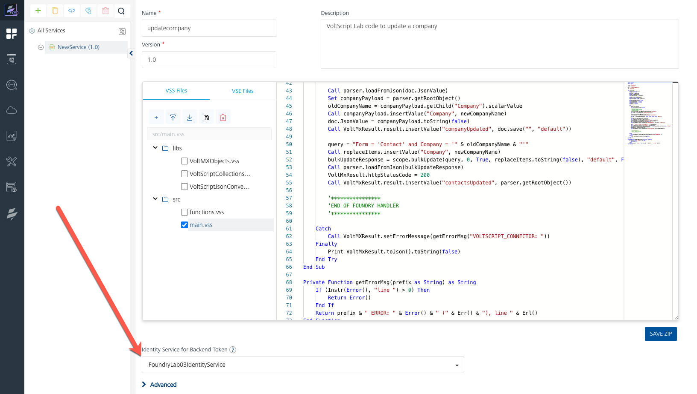
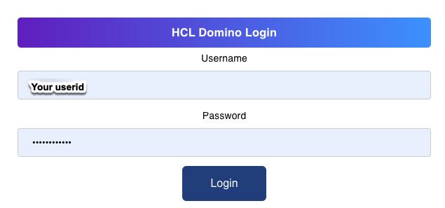
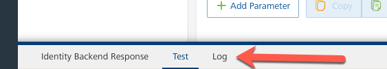
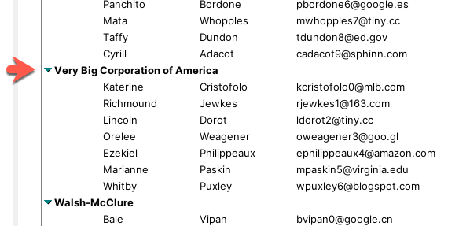

# VoltScript in Foundry Lab 03 - Foundry Identity Service and DRAPI Integration Service

## Duration 40 Min

## What you will learn

In this lab you will create a VoltScript Integration Service in Volt Foundry. You will use a previously created Identity Service for OAuth token authentication, and you will update documents in a previously populated DRAPI instance.  

!!! note
    The key difference between VoltScript in this lab and code from [previous labs] is in this lab you will **write your Voltscript in Volt Foundry**.  No VSCode instance is necessary.

## Prerequisites

- This exercise assumes that:
    - You have completed **Writing VoltScript in Volt Foundry** labs [01](lab-01.md) and [02](lab-02.md)

## Steps

### Configure an Identity Service

1. Log into Volt Foundry.
1. On the Apps page, create a new Foundry app.
1. On the **Identity Services** tab, follow the steps to create an [**Identity Service**](https://opensource.hcltechsw.com/voltmxgo-documentation/tutorials/adaptertutorial.html#configure-an-identity-service){: target="_blank" rel="noopener noreferrer"} with access to the scope for "Demo Companies and Contacts" database.

### Configure a new Integration Service

1. On the **Configure Services** tab, click **Integration** tab and then click **CONFIGURE NEW**.

    

1. Set the **Name** to `vs-in-foundry-drapi`.
1. Select "VoltScript" for **Service Type**.

#### Create a New VoltScript Connector Zip

1. Instead of selecting an exisiting or uploading a new VoltScript Connector Zip, click the **Create New** button.

    

1. Set the **Name** to "updatecompany".
1. Set the **Version** to "1.0", and optionally enter a **Description**.

!!! warning
    The Foundry workspace will not allow you to import a VSE Extension or upload a VSS Library into a new VoltScript Connector Zip until you have saved your `main.vss` file.

##### Add the Skeleton Code

1. On the *VSS Files* tab, click the **Add VSS** (**+**) button, then select **Add New File**.

    

1. In the *Add New File* dialog, enter "main.vss", then click **Add**.
As with [Lab 01](lab-01.md), your new vss file should be automatically prepopulated with the necessary skeleton code for your Integration Service.  

1. Click the **Save VSS** () button to save your `main.vss` file.

    

Before writing any actual code, you will need to add the necessary resources for this lab.

##### Import VSE Extensions

!!!note
    You will need to have login credentials for the [Volt MX Marketplace](https://marketplace.demo-hclvoltmx.com/) and for [GitHub](https://github.com/) so that you can access the latest resources.

In the same manner as you did for [Lab 01](lab-01.md), you will need to import VSE files for:

- ContextVSE
- JsonVSE
- DrapiVSE

##### Upload VSS Libraries

Add the following VSS libraries in the same manner as you did in [Lab 01](lab-01.md).

- VoltMXObjects.vss
- VoltScriptCollections.vss
- VoltScriptJsonConverter.vss

Now that we have successfully uploaded all of the needed resources, let's add some code to test; but before we continue, let's go ahead and save our Integration Service by click the **SAVE ZIP** button. You should then see a *Successfully updated.* status at the bottom of the page.

#### Write Your Integration Service Code

1. On the `VSS Files` tab, open the `src` folder on `main.vss` to open it in the editor.

1. After the Options, add the following directives:

    ``` voltscript
    UseVSE "*DrapiVSE"
    Use "../libs/VoltScriptJsonConverter" 
    ```

    !!! Question "Why no JsonVSE?"
        You may be wondering why we have not added a `UseVSE "*JsonVSE"` statement, even though we imported the VSE. The reason why is that the **VoltScriptJsonConverter.vss** library includes `Option Public` and `UseVSE "*JsonVSE"` directives; which brings the JsonVSE into **same scope** as `main.vss`.

1. Add the following declarations at the top of the `Sub Initialize`:

    ``` voltscript
    Dim request as DrapiRequest
    Dim doc as DrapiDocument
    Dim companyPayload as JsonObject

    Dim parser as New JsonParser()
    Dim server as New DrapiServer()
    Dim replaceItems as New JsonObject()

    Dim response as DrapiResponse
    Dim newCompanyName As String
    Dim oldCompanyName As String
    Dim query as String
    Dim unid as String
    ```

1. Add the following code between the **START OF FOUNDRY HANDLER** and **END OF FOUNDRY HANDLER** comment blocks:

    ``` voltscript
    server.serverURL = VoltMXRequest.getInputParam("serverURL")
    Set request = server.createRequest("companiesandcontacts")

    unid = VoltMXRequest.getInputParam("unid")
    newCompanyName = VoltMXRequest.getInputParam("CompanyName")

    Set doc = request.getDocument(unid, "html", "default")

    Call parser.loadFromJson(doc.JsonValue)
    Set companyPayload = parser.getRootObject()
    oldCompanyName = companyPayload.getChild("Company").scalarValue
    Call companyPayload.insertValue("Company", newCompanyName)
    doc.JsonValue = companyPayload.toString(false)
    Call VoltMxResult.result.insertValue("companyUpdated", doc.put("default"))

    query = "Form = 'Contact' and Company = '" & oldCompanyName & "'"
    Call replaceItems.insertValue("Company", newCompanyName)
    Set response = request.bulkPatchDocuments(query, replaceItems.toString(False), "html", "default", 5000, True, True)
    Call parser.loadFromJson(response.ContentBody)
    VoltMxResult.httpStatusCode = response.ResponseCode
    Call VoltMxResult.result.insertValue("contactsUpdated", parser.getRootObject())
    ```

1. Click the **Save VSS** () button to save your `main.vss` file.
1. Click the **SAVE ZIP** button to save the Zip file.

#### Get a Company UniversalID

1. Open the **Demo Companies and Contacts** database in either your Notes or your Nomad Client, and go to the **Contacts\by Company** view.
1. Make a note of a Company that has 1 or more contacts.
1. Switch to the **Companies** view and find the Company document. Use the Properties dialog to copy the UniversalID of the document.

    

1. Return to your Foundry interface.

#### Identity Service

1. Locate the **Identity Service for Backend Token** field.
1. Select the **Identity Service** you created in [VoltScript for Foundry - Lab 03](../foundry/lab-03.md#application)

    

#### Add An Integration Service Operation

1. Click **SAVE & ADD OPERATION**.
1. Set the name to "update".
1. Select "main.vss" as the file.
1. Click **ADD OPERATION**.
1. Scroll down to the **Request Input** tab and click **+ Add Parameter**.
1. Set the **NAME** to `serverURL`.
1. Set the **TEST VALUE** to your domino server's Domino REST API base url, for example `http://localhost:8880/api/v1`.

    !!! note
        The URL needs to end with `/api/v1`.

1. Click **+ Add Parameter** and set the **NAME** to `unid`.
1. Set the **TEST VALUE** to the UniversalID you copied from the **Companies and Contacts** database.
1. Click **+ Add Parameter** and set the **NAME** to `CompanyName`.
1. Set the **TEST VALUE** to a new value of your choosing.
1. Verify that the **ENCODE** checkbox for all parameters is checked.
1. Scroll down to the bottom of the operation and click **SAVE AND FETCH RESPONSE**.
1. On **Identity Backed Response** tab, click the **AUTHORIZE** button to begin the OAuth2 dance.
1. You should then be presented with an **Authentication Dialog**.  You will need to enter the appropriate userid and password for the identity service.

    

    ??? failure
        If your integration service fails you should receive JSON content to help identify the failure.  

        You can also click the **Identity Backend Response - Log** tab to view detailed log information about the failure.

        

    ??? success
        The output result shows a JSON object with:

        - `httpStatusCode` set to 200.
        - `companyUpdated` set to `true`.
        - `contactsUpdated` containing a JSON object of results for each contact update - UNID, success message, and status details.

#### Verify in Client

Even though the returned JSON indicates that the operation was successful, you can perform an additional verification:

1. Open the **Demo Companies and Contacts** database in either your Notes or your Nomad Client, and go to the **Companies** view.
1. You should be able to find a document for the new Company Name you provided earlier.
1. If you go to the **Contacts\by Company** view, you should be able to find Contact documents for the new Company Name.

    

The code for the lab is available on [GitHub](https://github.com/HCL-TECH-SOFTWARE/voltscript-samples/tree/main/samples/foundry-domino).

**Congratulations**

You have successfully used a VoltScript Integration Service to update DRAPI content while authenticating using an OAuth2 Token from a Volt Foundry Identity Service.  