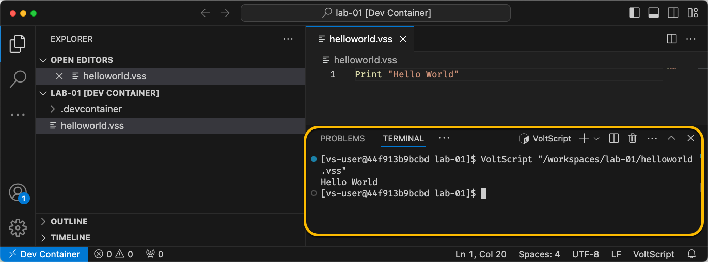

# Lab 01 - VoltScript simple program

## Duration 10 min

## What you will learn

You'll learn how to use the Visual Studio Code extension to compile and run basic scripts.

## Prerequisites

- [Visual Studio Code](https://code.visualstudio.com/) installed.
- [VoltScript runtime and VS Code Extensions](../../tutorials/ide/index.md) installed.

## Steps

### The IDE

1. Create a new VS Code VoltScript Workspace folder called **lab-01**:
    --8<-- "voltscript-ide.md"

### helloworld.vss

1. Click the **New File** icon above the empty pane for the folder. You can also right-click in the empty pane and select **New File** from the context menu.
1. Name the file "helloworld.vss".

    !!! warning
        A notification might be received "An error was thrown while processing document" in the bottom right of VS Code. This is normal. The file has been identified as a VoltScript file, but cannot be parsed by the language support at this time.

    !!! info
        Note the information at the right side in the status bar at the bottom of VS Code. The file is automatically identified as UTF-8, CRLF is used as the line ending, and the language has been identified as "VoltScript". To ensure compatibility with Linux, you should change line endings to LF.

1. Type `Print "Hello World"`.

    !!! info
        The language support extension doesn't contribute content assist (typehead) or formatting at this time. However, VoltScript code is compiled as you type. Errors are underlined in red and hovering will provide the compilation error. You can also find them in the **Problems** view by going to **View** &rarr; **Problems**, or pressing Ctrl+Shift+M.

--8<-- "voltscript-saveandrun.md"

    !!! Success
        A VoltScript terminal will open in your workspace and display the result of your script.
        

    !!! Tip
        VoltScript code doesn't have to be in a Sub. However, some language features, such as `Try...Catch` can only be used within a sub or function. A best practice is to start your code within a `Sub Initialize` method; as LotusScript developers will be familiar with that pattern.  In order to keep this lab as simple as possible that pattern was intentionally not followed.  

        Options settings can also used, such as `Option Declare` or `Option Public`.  Unfortunately at this time Visual Studio Code cannot be configure to add these automatically. 

## How to check

Print to console:

```bash
[xxxxxx lab-01]$ VoltScript "/workspaces/lab-01/helloworld.vss"
Hello World
[xxxxxx lab-01]$ 
```

The completed lab is available on [GitHub](https://github.com/HCL-TECH-SOFTWARE/voltscript-samples/tree/main/samples/intro-lab1){: target="_blank"}.

## Things to explore

- Put your code in `Sub Initialize` and run it.
- Add Option settings.
- Try alternate string delimiters `{}` and `||`. Note syntax highlighting is as expected.
- Try other language functions. `MsgBox` has become an alias to `Print`. As there is no UI and as VoltScript is intended for server-side processing only, so `MsgBox` makes no sense. Similarly, `InputBox()` is unsupported.

## Next step

 Proceed to [Lab 02 - VoltScript Project with VoltScript Library Module](lab-02.md).