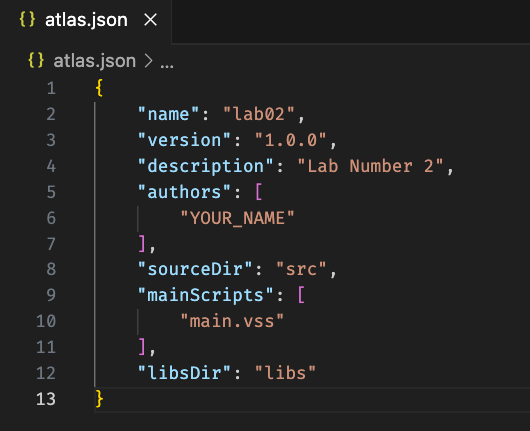
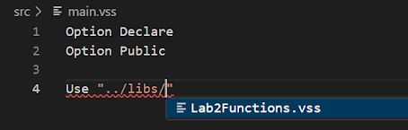
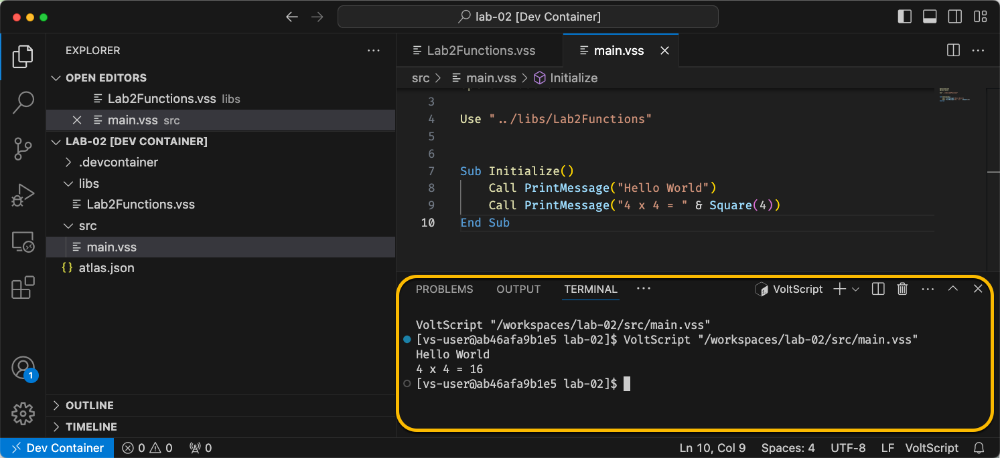

# Lab 02 - VoltScript Project with VoltScript Library Module

## Duration 15 min

## What you will learn

You'll learn how to use `atlas.json` and structure a VoltScript project. You'll also learn how to integrate external library modules with a `Use` statement.

## Prerequisites

- [Lab 01](./lab-01.md) completed

## Steps

### The IDE

1. Create a new VS Code VoltScript Workspace folder called **lab-02**.
    --8<-- "voltscript-ide.md"

### atlas.json

1. Create a new `atlas.json` file:
    --8<-- "atlas-json-initial.md"

1. Set name to "lab02".
1. Set version to "1.0.0".
1. Set description to "Lab Number 2".
1. Add the authors array. Add an array element with your name.
1. Set sourceDir as "src". Set mainScripts as `main.vss`.
1. Use content assist (Ctrl + space) to see other elements that can be added.
1. Set libsDir as "libs".
1. Save the `atlas.json`.



### libs directory

!!! note
    In the same way that you can create Script Libraries and use them in Domino Designer with the `Use` instruction, the same can be done in VoltScript. The terminology used to refer to these is "VoltScript Library Module".

1. Right-click in the empty pane and select **New Folder** from the context menu. Name the directory "src".
1. Right-click in the empty pane and select **New Folder** from the context menu. Name the directory "libs".
1. Right-click the "libs" directory and select **New File** from the context menu. Name the file "Lab2Functions.vss".
1. In the `.vss` file, add `Option Declare` and `Option Public`.
1. Type Sub. Snippets will offer you "Sub...". Press **Enter** to select the snippet. The following code will be inserted.

    ``` voltscript
    Sub ProcedureName(ParameterList)

    End Sub
    ```

1. `ProcedureName` is selected. Rename the sub "PrintMessage" and press **tab** to move to the next variable.
1. `ParameterList` is selected. Overtype it with `message as String`.
1. Move down to the body of the sub, and type `Print message`.
1. Move out of the sub, type "fun", and select the "Function..." snippet by pressing **Enter**.
1. `FunctionName` is selected. Rename the function "Square". Press **tab** to move to the next variable.
1. `ParameterList` is selected. Overtype it with `value as Integer`.
1. `ReturnType` is selected. Overtype it with `Integer`. Only the first instance of this will be replaced and a compilation error will remain "Variable not declared RETURNVALUE".
1. On the first line of the function, type `value *= value`.

    !!! tip
        Additional mathematical assignment operators have been added to the VoltScript language. In addition to the obvious `++` and `--` options, `+=`, `-=`, `*=` and `/=` (with its alias `\=`) have also been added.

1. Amend the last line of the function to `Square = value`.
1. Save the file.

### Main script

1. Right-click the "src" directory and select **New File** from the context menu. Name the file `main.vss`.
1. In the `.vss` file, add `Option Declare` and `Option Public`.
1. Add the statement `Use "../libs/Lab2Functions"`.  

    !!! warning
        VS Code *might* try to help you out here by providing typeahead here.  If so, be sure to remove the `.vss` from the end of the library name!  
        {: style="display:block;"}

    !!! note
        We can use relative paths in the `Use` statement. Using forward slashes make the `Use` statements cross-platform. Paths to Library Modules and downstream Library Modules (modules used in other Library Modules) need to work from any script opened. So all Library Modules should be at the same level of the hierarchy.

1. Add a `Sub Initialize`.
1. Add `Call PrintMessage("Hello World")`.
1. Add `Call PrintMessage("4 x 4 = " & Square(4))`.
--8<-- "voltscript-saveandrun.md"

    !!! Success
        A VoltScript terminal will open in your workspace and display the result of your script.
        

## How to check

Print to console:

```bash
Hello World
4 x 4 = 16
```

The completed lab is available on [GitHub](https://github.com/HCL-TECH-SOFTWARE/voltscript-samples/tree/main/samples/intro-lab2).

## Things to explore

- Change the content of the *Square()* function to `Return value * value`.

    !!! note
        The **Return** keyword is used to *immediately cease operations and exit* a method (Sub, Function or Property).  It the method is a *Function* or *Property Get*, the **Return** keyword will also return the subsequent value to the calling code.

- Test downstream VoltScript Library Modules (one module that uses another).
- Test to understand how relative paths need to work from all levels of the hierarchy.

## Next step

Proceed to [Lab 03a - Using VoltScript Dependency Management for VSEs and VSS Libraries](lab-03a.md).
