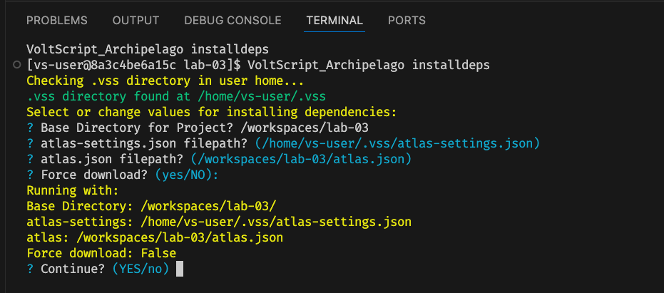
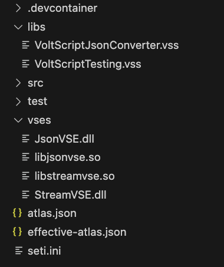

# Lab 03a - Using VoltScript Dependency Management for VSEs and VSS Libraries

## Duration 20 min

## What you will learn

You'll learn how to use dependency management, how it creates a `seti.ini`, and how to use `UseVSE` to include the VoltScript Extensions.

## Prerequisites

- [Lab 02](lab-02.md) completed

## Steps

### The IDE

1. Create a new VS Code VoltScript Workspace folder called **lab-03**.
    --8<-- "voltscript-ide.md"

### atlas.json

1. Create a new `atlas.json` file:
    --8<-- "atlas-json-initial.md"

1. Set name to "lab03".
1. Set version to "1.0.0".
1. Set description to "Lab Number 3".
1. Add the authors array. Add an array element with your name.
1. Set sourceDir as "src".
1. Set testDir as "test".
1. Set mainScripts as "main.vss".
1. Set libsDir as "libs".
1. Set vsesDir as "vses".
1. Add repositories array.
    1. Add a JSON object. Required properties for it will appear in the **Problems** view.
    1. Set id to "volt-mx-marketplace".
    1. Set type to "marketplace".
    1. Set url to "https://community.demo-hclvoltmx.com/marketplace".
    1. Add another JSON object. Required properties for it will appear in the **Problems** view.
    1. Set id to "hcl-github".
    1. Set type to "github".
    1. Set url to "https://api.github.com/repos/hcl-tech-software".
1. Add dependencies array. Add a JSON object. Required properties for it will appear in the **Problems** view.
    1. Set library to "voltscript-testing".
    1. Set version to "1.0.1".
    1. Set module to "VoltScriptTesting.vss".
    1. Set repository to "hcl-github".
1. Add another JSON object to the dependencies array.
    1. Set library to "voltscript-json-converter".
    1. Set version to "latest".
    1. Set module to "VoltScriptJsonConverter.vss".
    1. Set repository to "hcl-github".
1. Add vseDependencies object. This is an object, because each element needs a label that will be used in the `UseVSE` statement.
1. Add a label "StreamVSE". For the value, then add an empty JSON object.
    1. Set library to "StreamVSE VoltScript Extension".
    1. Set version to "1.0.4".
    1. Set module to "streamvse".
    1. Set repository to "volt-mx-marketplace".
1. **Save** the atlas.json. The final atlas.json should look like this:

```json
{
    "name": "lab03",
    "version": "1.0.0",
    "description": "Lab Number 3",
    "authors": ["YOUR_NAME"],
    "sourceDir": "src",
    "testDir": "test",
    "mainScripts": [
        "main.vss"
    ],
    "libsDir": "libs",
    "vsesDir": "vses", 
    "repositories": [
        {
            "id": "volt-mx-marketplace",
            "type": "marketplace",
            "url": "https://community.demo-hclvoltmx.com/marketplace"
        },
        {
            "id": "hcl-github",
            "type": "github",
            "url": "https://api.github.com/repos/hcl-tech-software"
        }
    ], 
    "dependencies": [
        {
            "library": "voltscript-testing",
            "version": "1.0.1",
            "module": "VoltScriptTesting.vss",
            "repository": "hcl-github"
        },
        {
            "library": "voltscript-json-converter",
            "version": "latest",
            "module": "VoltScriptJsonConverter.vss",
            "repository": "hcl-github"
        }
    ], 
    "vseDependencies": {
        "StreamVSE": {
            "library": "StreamVSE VoltScript Extension",
            "version": "1.0.4",
            "module": "streamvse",
            "repository": "volt-mx-marketplace"
        }
    }
}
```

!!! info
    VoltScript dependencies are, as with other dependency management systems, downloaded into a local repository in your user directory.  For Maven, it is `.m2`, for Rust, it is `.cargo`, and for VoltScript, it is **.vss**.  
    This allows dependencies to be built from local artifacts whenever possible, rather than pulling from remote locations.
    You can restrict which platform's VSE files get built into your product by using the `runtimePlatforms` element in atlas.json. For more details, see [How to Structure an atlas.json](../../references/atlas.md).

1. From the **Command Palette** in VS Code, run "VoltScript: Run Dependency Setup".  
This will ensure that (among other things) a **.vss** folder is created within your VoltScript workspace.  

### atlas-settings.json

--8<-- "atlas-settings-initial.md"

### VoltScript Dependency Manager

!!! info
    VoltScript Dependency Manager can use any of three repository types, as defined in the atlas-settings.json file.  These types are:  

    - **github** A GitHub repository requires a Personal Access Token, associated with the "token" element from the atlas-settings object.   
    - **webserver** A Web Server repository requires *Base64 encoded* credentials, which are specified in the *credentials* element.
    - **marketplace** A specialized form of Web Server repository, the Marketplace is for a (usually a Volt-MX Marketplace) website that accepts a username and password.  These values are passed after a secure SSL connection is made with the remote site defined in the *authURL* element.  

The VoltScript Dependency Manager requires 4 pieces of information:

- The *folder* for the project (your workspace folder)
- The location of the *atlas.json* file, from which to build the dependencies.
- The location of the *atlas-settings.json* file, from which to get the necessary authentication information for any repositories defined in *atlas.json*.
- A boolean instruction to *force reload* from remote repositories in the event that local resources already exist.

!!! tip
    When you run the VoltScript Dependency Manager, it will ask you for this information one at a time, and will preload the default answer for subsequent questions using the information from your answers.  If you do not answer quickly enough, it will timeout and proceed to the next question.  Therefore it is a good idea to copy your VoltScript workspace filepath to your clipboard (the first question) before proceeding.  

    

1. From the **Command Palette**, run "VoltScript: Install Dependencies".  

    This will invoke VoltScript executable and instruct it to run the VoltScript Dependency Manager *(archipelago.vss)*.  Answer the questions one at a time (or just press Enter to accept the default) to proceed.  

    The VoltScript Dependency Manager will (depending upon your connection speed) take a few moments to complete operations.  If any problems occur they will be listed in the VS Code terminal window.  **Nearly All** problems that occur are due to either entering the *directory* incorrectly when prompted, or invalid / incomplete information in the atlas.json file.  *It is very common* to make a mistake here, methodically check your JSON and VoltScript Workspace folder hierarchy if you have problems.  

!!! success  
    Assuming the VoltScript Dependency Manager runs to completion, your project should now have "src", "test", "libs" and "vses" directories.

    - The src directory will normally be empty.
    - The test directory will normally empty.
    - The libs directory should now be populated with `VoltScriptTesting.vss` and `VoltScriptJsonConverter.vss`.
    - The vses directory should now be populated with dll and so files for StreamVSE and JsonVSE.  JsonVSE is a *downstream dependency* used by VoltScript JSON Converter, and is automatically picked up because it is listed in the atlas.json for VoltScript JSON Converter.
    - A new file, `seti.ini`, has been created. This contains mappings for the VoltScript Extensions (VSEs) and will be used when processing `UseVSE` statements.
    - A new file, `effective-atlas.json`, has been added to the root of the directory. This contains the aggregated settings for the project.

    {:style="max=width:50%"}

Proceed to [Lab 03b - Using a VoltScript Extension to parse JSON](lab-03b.md)
