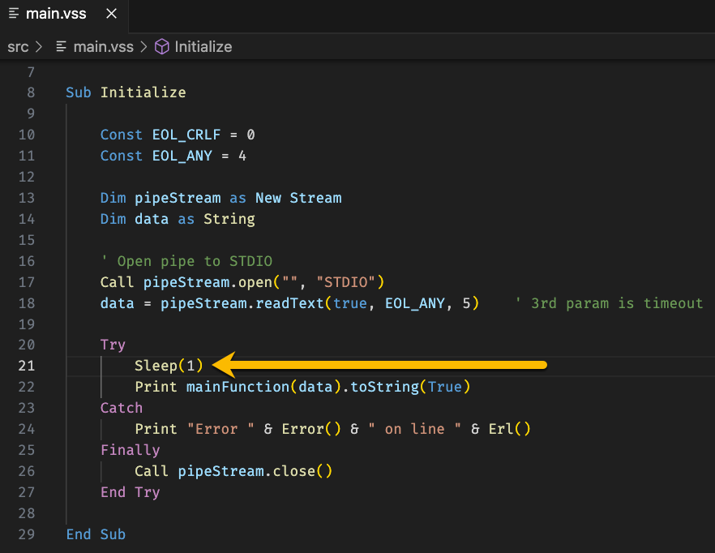
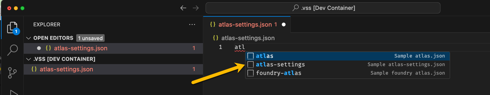

# Lab 03b - Using a VoltScript Extension to parse JSON

## Duration 20 min

## What you will learn

You'll learn how to do basic JSON parsing using the `JsonVSE` VoltScript Extension.

## Prerequisites

- [Lab 03a](lab-03a.md) completed

## Steps

### Simple Script

1. Download [functions.vss](https://github.com/HCL-TECH-SOFTWARE/voltscript-samples/blob/main/samples/intro-lab3/.resources/functions.vss){: target="_new" rel="noopener noreferrer”} and save it to the **libs** folder.  
1. Download [main.vss](https://github.com/HCL-TECH-SOFTWARE/voltscript-samples/tree/main/samples/intro-lab3/.resources/main.vss){: target="_new" rel="noopener noreferrer”} and save it to the **src** folder.
1. Open src/main.vss and review the script.

    - The script starts and then reads the first line of text from command line input using StreamVSE and a new Stream (`pipeStream`).
    - It then tries to convert the data to JSON using JsonVSE (`jsonParser`).
    - It then tries to convert the JSON to a Variant array of Person objects using VoltScriptJsonConverter (`JsonConversionHelper`).
    - It then builds a response JSON object using the Person class's `getName()` function and pretty-prints the output.
    - If an error occurs, it is printed to the console and (in the finally block) the stream is closed.

!!! info "Troubleshooting"
    There is a known and as yet to be resolved timing issue with Streams in VoltScript and Standard Input/Output (STDIO) when **running in a linux dev container**. The processing happens so fast that the I/O will close before buffered content (Print Statements) have completely cleared.  The net effect of this is that Printed output is simply lost.  
    Fortunately there is a relatively simple work-around.  Simply add a **Sleep(1)** statement to your code after the stream reads content (in this case, `data = pipeStream.readText(true, EOL_ANY, 5)`).  This will cause the VoltScript executable to pause processing for 1 second; giving the buffer time to clear, allowing subsequent `Print` statements to operate as expected.
    

1. Copy the following JSON content to your clipboard.

    ```json
    [{"id":1,"firstName":"Bobby","lastName":"Stodd","email":"bstodd0@ibm.com","gender":"Male"},{"id":2,"firstName":"Leeanne","lastName":"Mortimer","email":"lmortimer1@posterous.com","gender":"Female"},{"id":3,"firstName":"Rochette","lastName":"Santora","email":"rsantora2@unc.edu","gender":"Female"},{"id":4,"firstName":"Missy","lastName":"Prestedge","email":"mprestedge3@nih.gov","gender":"Female"},{"id":5,"firstName":"Cleavland","lastName":"Lortzing","email":"clortzing4@gov.uk","gender":"Male"}]
    ```

1. Return focus to the main.vss file in your VS Code editor.
--8<-- "voltscript-saveandrun.md"

1. Paste the JSON from clipboard into the paused VoltScript terminal window and press **Enter** to pass the string into the script. The file is at [sampleJson](https://github.com/HCL-TECH-SOFTWARE/voltscript-samples/tree/main/samples/intro-lab3/.resources/sampleJson.json){: target="_new" rel="noopener noreferrer”}.

!!! success
    You have successfully read in a complex JSON array from the command line, converted it to an array of VoltScript objects with two lines of code, and manipulated the data for a response.

## Review

This gives you an idea of a day in the life of a Volt MX Go VoltScript developer. You will use VoltScript Dependency Manager to avoid having to copy and paste dependencies around. You will be writing middleware functions, which will receive input from an Iris app, including parameters and query string information. It will then need to act upon that data, potentially retrieving data from a **_remote_** database, and return a JSON response for the Iris app.

In the [things to explore](#things-to-explore), you can change the function so it can be unit tested. Apart from input, there is no external integration, so integration tests are irrelevant. These tests will allow you to prevent regression bugs. The same process can be used to check output for dummy input from the IDE, without running from command line.

The code for the lab is available on [GitHub](https://github.com/HCL-TECH-SOFTWARE/voltscript-samples/tree/main/samples/intro-lab3).

## Content Assist  

Content assist is available for both `atlas.json` and `atlas-settings.json`. To explore this, create a new `atlas.json` or `atlas-settings.json` file, and in the editor simply start typing the word 'atlas'.   A content-assist dialog will appear, from which you can click on the appropriate content you wish.  Doing so will auto-populate your new file with default content.  



## Things to explore

### Unit Tests

1. Create a new file in test called `unitTests.vss`.
1. Paste in the following code:

    ``` voltscript
        Option Declare
        Option Public

        UseVSE "*JsonVSE"
        Use "../libs/VoltScriptTesting"
        Use "../libs/functions"

        Sub Initialize
            Dim testSuite as New TestSuite("Unit Tests")
            Dim data as String
            Dim response as JsonObject
            Dim children as Variant

            data = |[{"id":1,"firstName":"Bobby","lastName":"Stodd","email":"bstodd0@ibm.com","gender":"Male"},{"id":2,"firstName":"Leeanne","lastName":"Mortimer","email":"lmortimer1@posterous.com","gender":"Female"},{"id":3,"firstName":"Rochette","lastName":"Santora","email":"rsantora2@unc.edu","gender":"Female"},{"id":4,"firstName":"Missy","lastName":"Prestedge","email":"mprestedge3@nih.gov","gender":"Female"},{"id":5,"firstName":"Cleavland","lastName":"Lortzing","email":"clortzing4@gov.uk","gender":"Male"}]|
            Set response = mainFunction(data)
            Call testSuite.describe("Check five elements returned").assertEqualsInteger(5, response.childCount)
            children = response.getChildren()
            Call testSuite.describe("Check first element has name").assertTrue(children(0).IsChild("name"))
            Call testSuite.describe("Check first name is Bobby Stood").assertEqualsString("Bobby Stood",_
                children(0).getChild("name").scalarValue, True)
        End Sub
    ```

--8<-- "voltscript-saveandrun.md"

1. Information on the test run will be printed to the **Output** view, showing that 3 tests ran, one of which failed.
1. A "unit-test-reports" directory will be added, and a file will be created. Right-click and select **Reveal in File Explorer**.
1. Right-click the file and open in a browser.
1. Click on the failing test and diagnose the problem. The test is checking for "Stood", but the correct value is "Stodd".
1. Change the assertion and **don't forget to also change the test description**.
1. Run the tests again.

!!! success
    The tests should now run successfully.

### Other things to explore

- Investigate content assist for `atlas.json` and `effective-atlas.json`.
- Review what's printed to output for VoltScript Dependency Manager.
- Look at the `effective-atlas.json` and understand the structure.

- Consider how the VoltScript Dependency Manager might impact community involvement. What do you think needs to be included in source control repositories?
- Consider how the VoltScript Dependency Manager might be used in a CI/CD environment. What do you think should be included / excluded from your source control repositories?
- Review the `seti.ini`. Review the use of relative paths. Identify how module is adapted to the actual filename expected.

!!! note
    VoltScript Extensions for all operating systems will be added to the relevant directory in your project, ready for deployment on any operating system!
